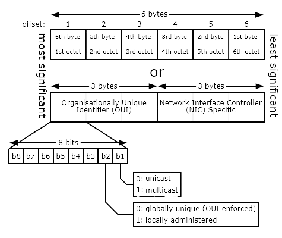

# ACIT 2620

## Principles of Enterprise Networking

By: Yves Rene Shema

---

# Ethernet

---

    

---

## Data Link Layer Sublayers

<dl>
    <dt>Logical Link Control (LLC)</dt>
    <dd>Used to facilitate multiple upper layer (i.e. network ) protocols</dd>
    <dd>Provides common interface to upper layers</dd>
    <dd>Supplies multiplexing and flow control services</dd>
    <dd>Provides error checking</dd>
</dl>   

---

<dl>
    <dt>Media Access Control (MAC)</dt>
    <dd>Provides addressing and channel access control mechanisms (i.e. CSMA CD, CSMA CA)</dd>
    <dd>Appends physical address of destination computer onto the frame</dd>
</dl>

---

## Frames

- Preamble
  - Marks beginning of entire frame
- Start of Frame Delimiter (SFD)
  - Indicates beginning of addressing fields
- Destination Address
  - Contains destination node address

---

- Source Address
  - contains address of sender node
- Length (LEN)
  - indicates length of data/payload
- Data (payload)
  - contains data, or segmented part of data, transmitted from originating node

---

- Pad
  - Used to increase size of the frame to its minimum size requirement of 46 bytes
- Frame Check Sequence
  - provides algorithm to determine whether data were correctly received
  - most commonly used algorithm is Cyclic Redundancy Check (CRC)

---

## Ethernet Addressing

- MAC address: Media Access Control (MAC) sub-layer
- 48 Bits
- Number uniquely defining a network node
- Generally rendered as Hex: __`00:1e:33:ba:87:c1`__
- Doesn't contain any data regarding network location –just an ID

---

    

---

- first three bytes
  - Either Manufacturer hard coded
  - Or Reserved Addresses (common ones)
    - Broadcast Address __`FF:FF:FF:FF:FF:FF`__
    - Spanning Tree Multicast: __`01:80:C2:00:00:00`__
    - IANA reserves all address starting with __`00:00:5E`__ see Ethernet Numbers(this includes IPv4 multicast -and inserts the low 23 Bits of the multicast IPv4 Address into the Ethernet Address)
    - __`33:33:XX`__ is reserved for IPv6 Multicast

---

## Switching

- Making Forwarding decisions
  - Transparent bridging

    

---

## Broadcast Loop and STP

    

---

### Spanning Tree Protocol

    

---

## VLANs

- Virtual Local Area Networks
- A logical network within a physical network
- Achieved by grouping some of the switch ethernet ports into a logical broadcast domain
- Can span multiple switches

---

    

---

### VLAN port types

- Access ports
  - assigned VLAN ID
  - for connecting end hosts/nodes
  - nodes connected to ports with same VLAN ID are in the same broadcast domain

---

- Trunk ports
  - typically for switch to switch or switch to router connection
  - carry "tagged" frames, i.e modified ethernet frames with VLAN markers

---

### Tagged frames

    

- 4-byte tag header inserted between Source MAC and EtherType fields
  - 2-byte tag protocol identifier (TPID) 
    - a fixed value of 0x8100 that indicates the frame carries tag information.

---

- 2-byte tag control information (TCI)
  - Three-bit user priority (used to prioritize traffic)
  - Drop Eligible Indicator (DEI) (in congestion is frame “dropable”)
  - Twelve-bit VLAN identifier (VID)-Uniquely identifies the VLAN to which the frame belongs

---

## Link Access Methods

- Manage shared medium access contention (collision)
- Two methods:
  - CSMA/CD: for wired Ethernet
  - CSMA/CA: for wireless Ethernet

---

### CSMA/CD

---

### CSMA/CA

    

---

## Reading List

- [IPv4 Addressing (video)](https://learning.oreilly.com/videos/comptia-network-n10-008/9780137507450/9780137507450-N108_03_09_04/)
- [Internet Protocol Version 4](http://intronetworks.cs.luc.edu/current2/html/ipv4.html)
