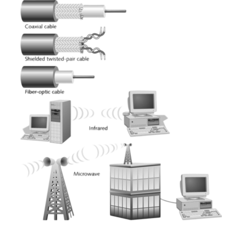
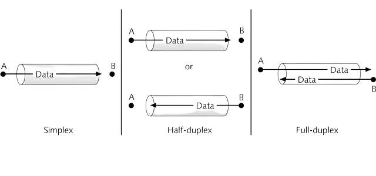
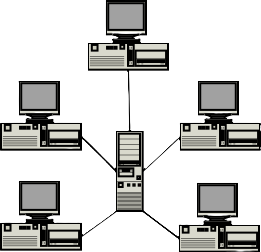
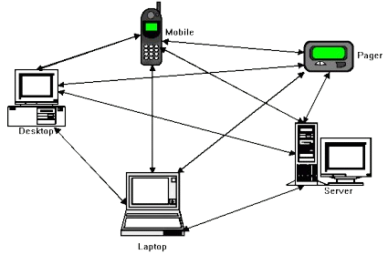
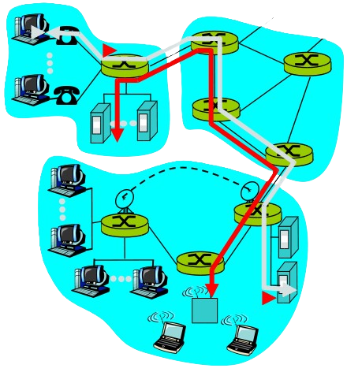
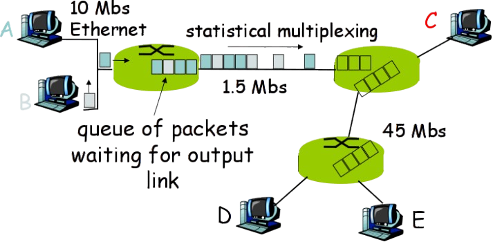
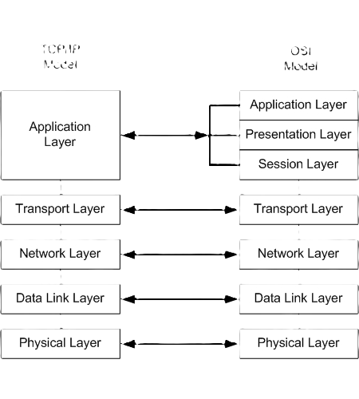
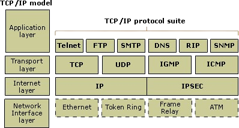

# ACIT 2620

## Principles of Enterprise Networking

By: Yves Rene Shema

---

## Objectives

* Course logistics
* Overview of networking concepts and terminologies
* Layered networking model 
* Project introduction 
* Packet capture

---

## Course logistics

### Software and equipment

* Software: Python 3, Virtualbox, Wireshark
* Equipment: 
  * Windows 10 or higher, preferably Pro or Education editions
  * Limited support for Mac, especially the new Apple Silicon generation (i.e. you may need to get a different computer for this course. Older Macs are fine.)
  * Linux: I'll suppose you know what you're doing

---

### Assessment

| Criteria | % | Comments |
| --- | --- | --- |
| Quizzes | 40 | Four equally weighted quizzes. No midterm |
| Project | 20 | Cumulative. 5 milestones | 
| Final exam | 40 | Practical, based on project |

* Quizzes are in person. If you miss a quiz, it's gone; there are no makeovers!
* Late project submissions (more than 1 week after deadline) will not be graded.
  
---

## What is the internet

* What is it made of?
  * catalog the different components that make up the internet infrastructure and describe the role of each
* what is its purpose?
* How does it work?
  * how do the different networking components interface with each other
  * what governs communication between them
----

## Network

* Collection of `nodes` connected by some type of transmission media or `link`, for the purpose of sharing services, devices or data (i.e. networked `resources`)

---

## Node

* Any device that can communicate over the network and is identified by a unique identifying number, known as its `network address`.

---

## Link

---

## Media concurrency and direction

---

# Resource Control

---

## Client-server Networks

  
---

## Peer-to-peer Networks

---

## Types of Networks

* LAN
* WLAN
* PAN
* CAN
* MAN

---

* WAN
* SAN
* EPN
* VPN
* [Learn more](https://www.belden.com/blogs/network-types)

---

# Switching Methods

---

## Circuit Switching

---

## Packet Switching

---

## Layered networking model

---

## Layered why?

- Managing complexity: explicit structure allows identification and makes explicit the relationship of complex system's pieces
- Modularization: changing of an implementation of a specific layer's service is hidden from the rest of the system

---

## Encapsulation

---

## Protocol Data Units (PDU)

---

## Protocols

---

* Mutually agreed upon rules for communication
* Define the format, order of messages sent and received among network entities, and actions taken upon transmission, receipt, and timeout
* Govern all communication activity on the internet

---

## TCP/IP protocol suite

---

## Wireshark

- A tool for capturing network traffic for analysis
- [Grab the installer](https://www.wireshark.org/download.html) and install it on your system

---

## Reading list

- This week
  - [OSI Model](https://www.oreilly.com/videos/networking-fundamentals/9780134645711/9780134645711-NETP_1_1_0_0/)
  - Optional reading:
    - [Wireshark: filtering while capturing]()
    - [Capture filters]()
    - [Display filters]()

---

- Week Two (read/watch these before next class)
  - [Common Network Infrastructure devices](https://www.oreilly.com/videos/networking-fundamentals/9780134645711/9780134645711-NETP_2_2_0_0/)
  - [Network devices](cisco_network_essentials_ch10_network_devices.pdf)
  - [Network Topologies](https://www.oreilly.com/videos/networking-fundamentals/9780134645711/9780134645711-NETP_3_0_0_0/)
  - [Overview of networks](https://intronetworks.cs.luc.edu/current2/html/intro.html)
  - Optional (but highly recommended):
    - [Linux command line (recommended for beginners)](https://ubuntu.com/tutorials/command-line-for-beginners#1-overview)