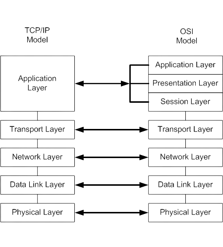
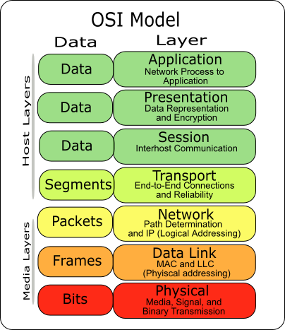
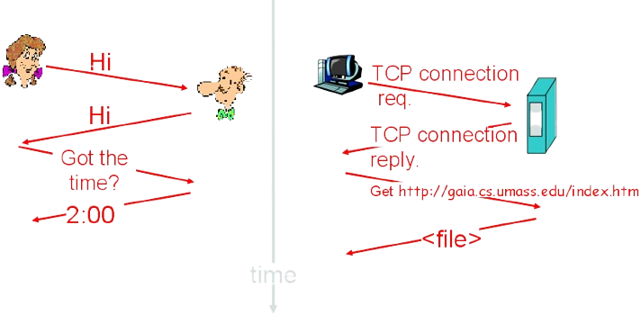

# ACIT 2620

## Principles of Enterprise Networking

By: Yves Rene Shema

---

## Objectives

- Overview of networking concepts and terminologies
- Layered networking model 
- Project introduction 
- Packet capture

---

## What is the internet

- What is it made of?
- what is its purpuse?
- How does it work?

---

## Network

Collection of `nodes` connected by some type of transmission media or `link`, for the purpose of sharing services, devices or data (i.e. networked `resources`)

---

## Node

Any device that can communicate over the network and is identified by a unique identifying number, known as its `network address`.

---

## Link

---

## Media concurrency and direction

---

# Resource Control

---

## Client-server Networks

  
---

## Peer-to-peer Networks

---

## Types of Networks

* LAN
* WLAN
* PAN
* CAN
* MAN

---

* WAN
* SAN
* EPN
* VPN

[Learn more](https://www.belden.com/blogs/network-types)

---

# Switching Methods

---

## Circuit Switching

---

## Packet Switching

---

## Layered networking model

---

## Layered why?

- Managing complexity: explicit structure allows identification and makes explicit the relationship of complex system's pieces
- Modularization: changing of an implementation of a specific layer's service is hidden from the rest of the system

---

## Protocol Data Units (PDU)

---

## Encapsulation

---

## Protocols

---

- Mutually agreed upon rules for communication
- Define the format, order of messages sent and received among network entities, and actions taken upon transmission, receipt, and timeout
- Govern all communication activity on the internet

---

## TCP/IP protocol suite

---

## Wireshark

- A tool for capturing network traffic for analysis
- [Grab the installer](https://www.wireshark.org/download.html) and install it on your system

---

## Reading list

* This week
  * [OSI Model](https://www.oreilly.com/videos/networking-fundamentals/9780134645711/9780134645711-NETP_1_1_0_0/)
  * Optional reading:
    * [Wireshark: filtering while capturing]()
    * [Capture filters]()
    * [Display filters]()

---

* Week Two (read/watch these before next class)
  * [Common Network Infrastructure devices](https://www.oreilly.com/videos/networking-fundamentals/9780134645711/9780134645711-NETP_2_2_0_0/)
  * [Network devices](cisco_network_essentials_ch10_network_devices.pdf)
  * [Network Topologies](https://www.oreilly.com/videos/networking-fundamentals/9780134645711/9780134645711-NETP_3_0_0_0/)
  * [Overview of networks](https://intronetworks.cs.luc.edu/current2/html/intro.html)
  * Optional (but highly recommended):
    * [Linux command line (recommended for beginners)](https://ubuntu.com/tutorials/command-line-for-beginners#1-overview)