

# ACIT 2620

## Principles of Enterprise Networking

By: Yves Rene Shema

---

# Internet Protocol Version 4

---

## TCP/IP Suite

- Internet Protocol (IP)
- Routing Protocols (Used in routing table generation)
- Dynamic Host Configuration Protocol (DHCP)
- Transport Control Protocol (TCP)
- User Datagram Protocol (UDP)
- Internet Control Message Protocol (ICMP)
- Address Resolution Protocol (ARP)

---

## Recap: Data-link layer

- Generally Ethernet
- Handles the movement of data between nodes on the same link
- Present on every network device
- Data Link Specific Devices: bridge, hub, switch

---

## Network Layer

- __Goal__: move packets for source to destination
  - __Path Determination__:
  the calculation of the route taken by packets -> routing
  - __Forwarding__:
  The movement of a packet from one network to the next appropriate network

---

## Network Layer functions

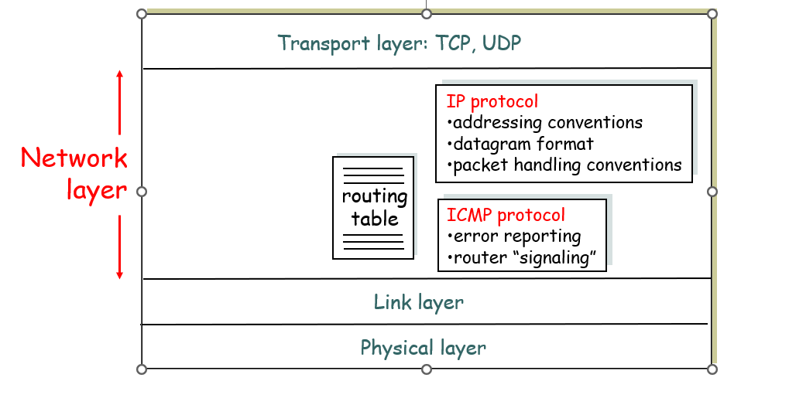

---

## Internet Protocol (IP)

- Provides information about how and where data should be delivered
- Responsible for __internetworking__ (from where the term internet is derived)

---

- To internetwork is to traverse more than one LAN segment and more than one type of network through a router
- In an internetwork, the individual networks that are joined together are called subnetworks

---

- IP is an unreliable, connectionless protocol, which means it does not guarantee delivery of data
- i.e IP will service a request without requesting verified session and without guaranteeing delivery of data, making it simpler and faster

---

## IP Addressing

- __IP address__: 32-bit identifier for host, router interface
- __interface__: connection between host, router and physical link
  - routers typically have multiple interfaces
  - host may have multiple interfaces
  - IP addresses associated with interface, not host, router

---

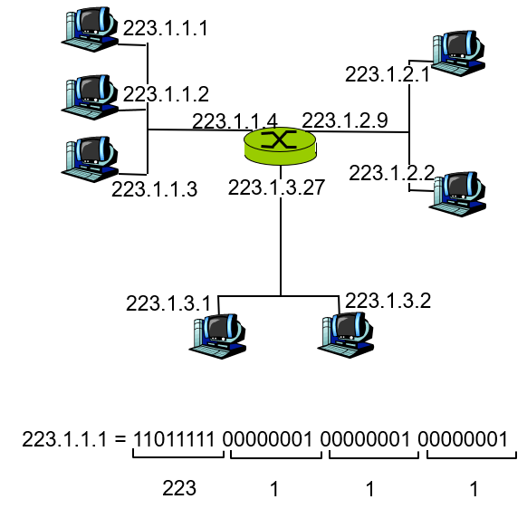

---

### Components of an IP address

- network part (high order bits)
- host part (low order bits)

---

### IP Network

- device interfaces with same network part of IP address
- can physically reach each other without intervening router

---

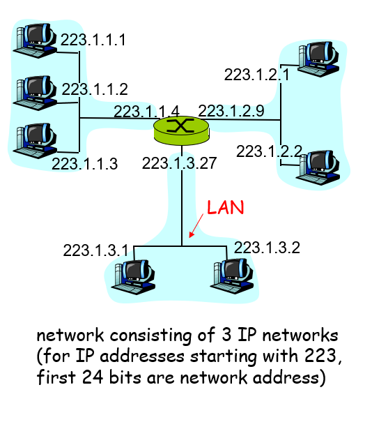

---

How many networks do you see?

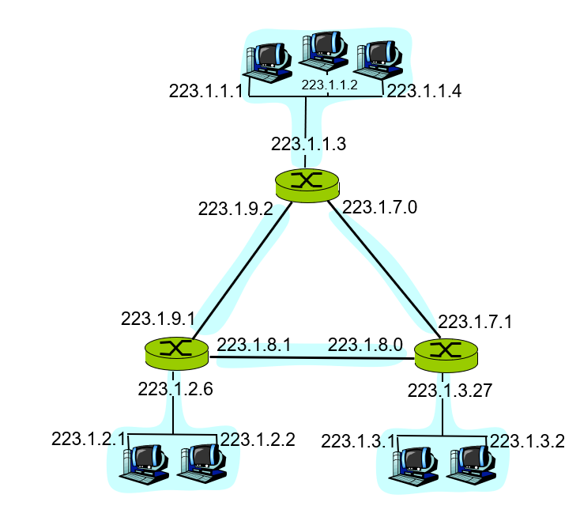

---

## IP Address Space

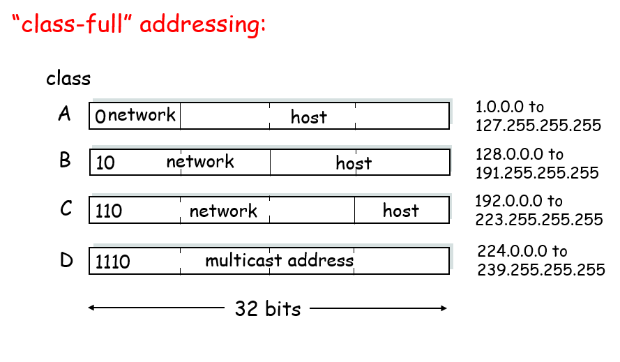

---

## IP range notations

- __CIDR__: Classless Inter Domain Routing
  - network portion of address of arbitrary length
  - address format: __`a.b.c.d/x`__, where `x` is # of bits in network portion of address
  - Also written as address + subnet mask

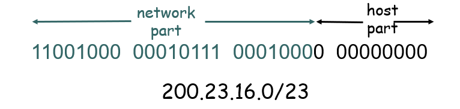

---

- CIDR using Subnet Mask
  - Usually written in dotted decimal notation reminiscent of an IP address

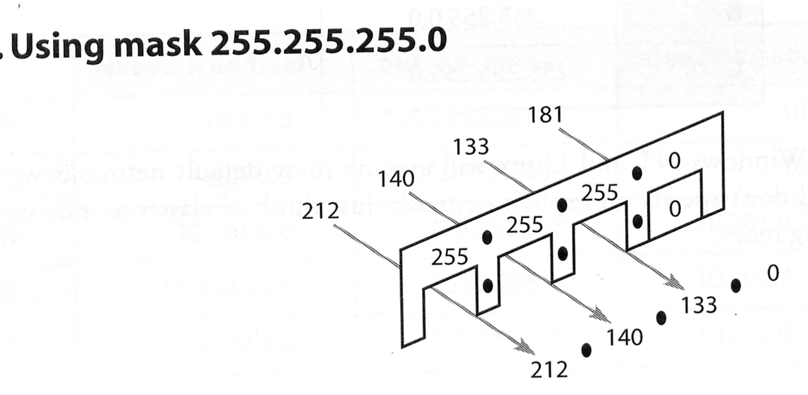

---

## Special Addresses

- Private IP Addresses
  - 10.0.0.0 - 10.255.255.255
  - 172.16.0.0 - 172.31.255.255
  - 192.168.0.0 - 192.168.255.255

---

- Documentation IP Addresses
  - 192.0.2.0 - 192.0.2.255
- Self-Configured IP Addresses (often DHCP Failure)
  - 169.254.0.0 - 169.254.255.255

---

- Unknown Address
  - 0.0.0.0
- Loopback Address
  - 127.0.0.1 (actually, 127.0.0.0/8)
- Network Address (All host bits set to 0)
  - E.g: 192.168.1.0, Subnet Mask = 255.255.255.0 

---

## Broadcasting and Multicasting

- Limited Broadcast
  - 255.255.255.255
  - Transmitted only on local segment - not routed
- Network Broadcast Address
  - Network Address + All host bits set to one
    - Network Address = 192.168.1.x
    - Network Broadcast Address = 192.168.1.255

---

- Multicast Address
  - Lie within the 224.0.0.0 /4 network
  - [http://www.iana.org/assignments/multicast-addresses](http://www.iana.org/assignments/multicast-addresses)

---

## IPv4 Header

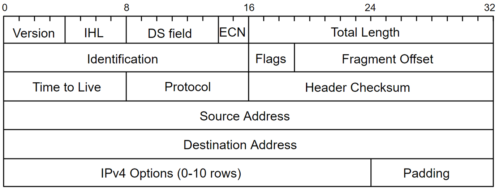

---

## IPv4 routing: the basics

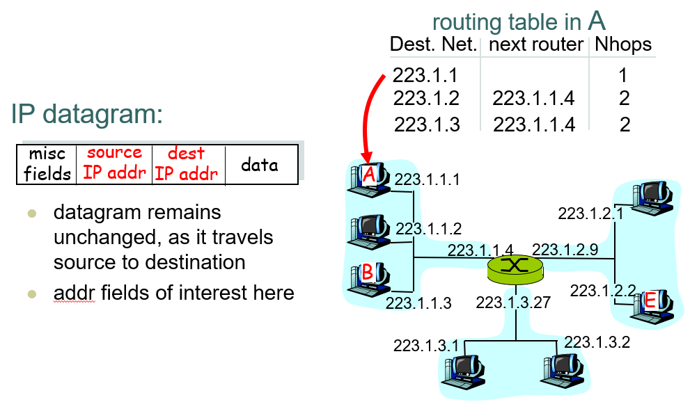

---

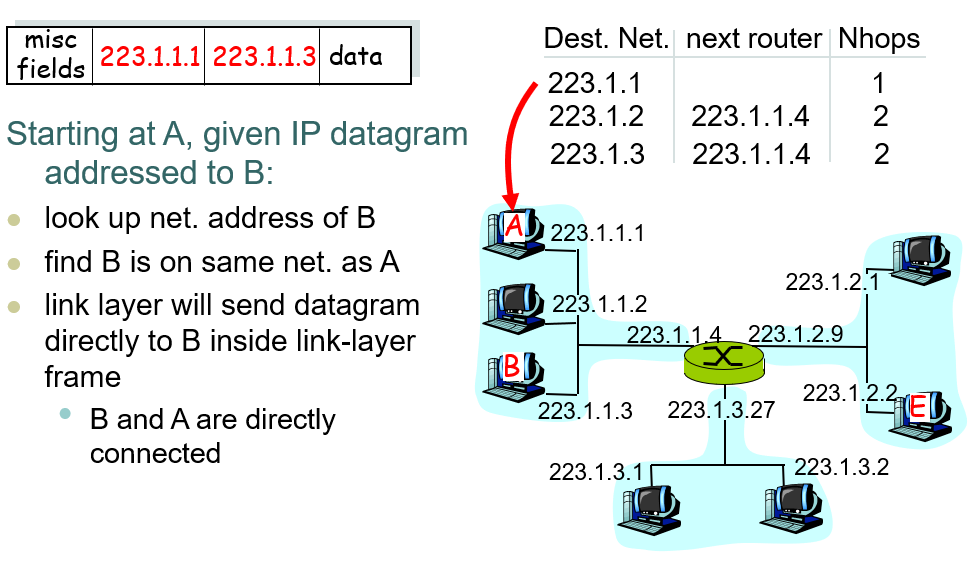

---

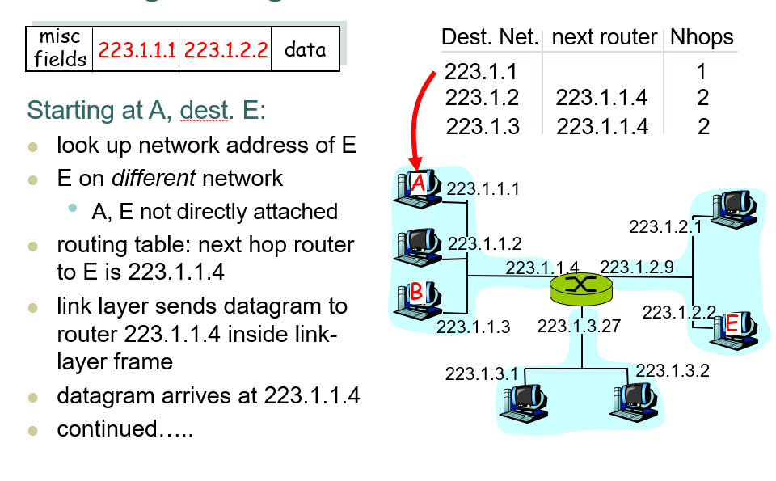

---

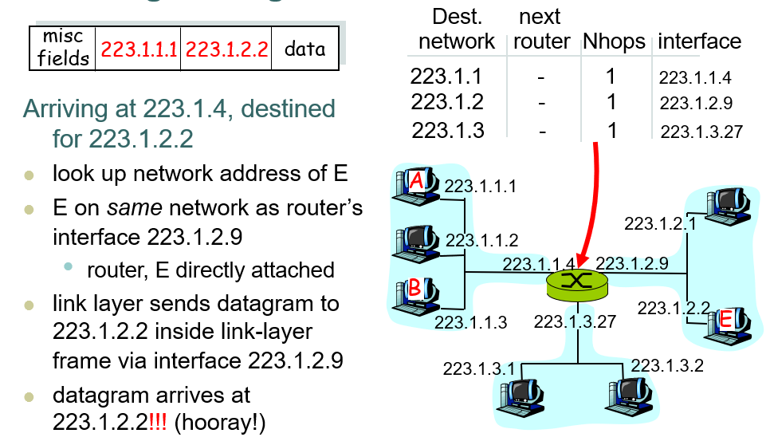

---

## Next: IPv4 subnetting

---

## Reading List

- [IPv4 Subnets](http://intronetworks.cs.luc.edu/current2/html/ipv4.html#ipv4-subnets)
