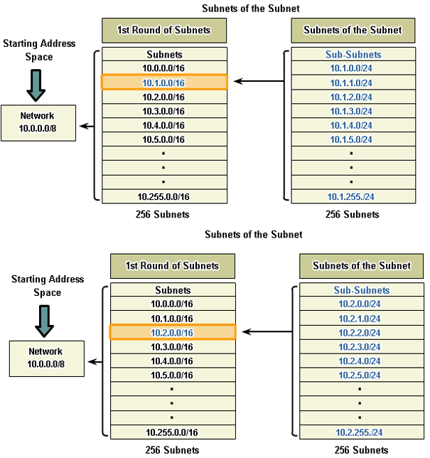
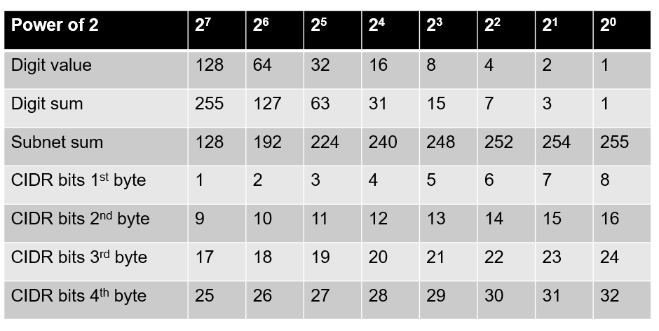
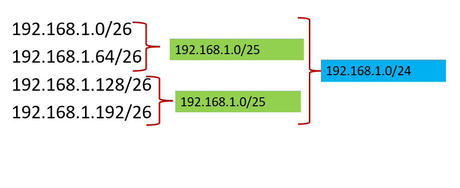

# ACIT 2620

## Principles of Enterprise Networking

By: Yves Rene Shema

---

# IPv4 Subnetting

---

## IP address space

* `IP address`: 32-bit identifier for host, router interface
* This translates to **4,294,967,296** unique addresses
* The internet is network of networks, i.e. a collection of multiple IP networks spread across the globe
* Each IP network is a range of IP addresses – a smaller address space
* An IP address space is identified by a subnet ID obtained using a subnet mask
* The size of the address space is determined by the hosts bits

---

> The internet does not have a hierarchical topology, rather the interpretation of addresses is hierarchical.
> -- (RFC 950)

---

## IP addressing: ISPs

* **Q**: How does an ISP get block of addresses?
* **A**: ICANN: Internet Corporation for Assigned Names and Numbers
  * allocates addresses
  * manages DNS
  * assigns domain names, resolves disputes

---

## IP addresses: how to get one?

Network (network portion):

* get allocated portion of ISP’s address space:
  * ISP's block       11001000  00010111  00010000  00000000    200.23.16.0/20
  * Organization 1    11001000  00010111  00010010  00000000    200.23.18.0/23
  * Organization 2    11001000  00010111  00010100  00000000    200.23.20.0/23
  * ...
  * Organization 7    11001000  00010111  00011110  00000000    200.23.30.0/23

---

## Subnetting

* The prefix “sub” implies a relation (i.e. a portion of another larger network)
* It is the process dividing a larger address range into a contiguous sets of addresses (whose size is a power of 2) to best reflect a network’s logical topology
* Example:
  * Subnet 10.1.0.0/16
    * 8 more bits are assigned to the network ID, to create 256 subnets with a /24 mask.
  * Mask allows for 254 host addresses per subnet
  * Subnets range from:
    * 10.1.0.0 / 24 to 10.1.255.0 / 24

---

## Subnetting: Why?

* Smaller networks are easier to manage
* Network topology constraints
* Reduced network traffic. LANs rely on ARP broadcasting to communicate. Because of this broadcasting nature of LAN, larger networks mean poor performance
* Increased security
* Reduced IP wastage

---

---

## Subnetting table

| CIDR Notation | Network Mask | Available Networks | Available Hosts per network | Total usable hosts |
| --------------| -------------| -------------------| ----------------------------| -------------------|
| /24 | 255.255.255.0 | 1 | 254 | 254 |
| /25 | 255.255.255.128 | 2 | 126 | 252 |
| /26 | 255.255.255.192 | 4 | 62 | 248 |
| /27 | 255.255.255.224 | 8 | 30 | 240 |
| /28 | 255.255.255.240 | 16 | 14 | 224 |
| /29 | 255.255.255.248 | 32 | 6 | 192 |
| /30 | 255.255.255.252 | 64 | 2 | 128 |

---

## Subnet size

* Each subnet represents a finite address space, a block or range of IP addresses
* The first address in the range is used to identify the entire subnet
* The last address in the range is the broadcast address for the subnet
* If N is the size of subnet S, then the number of usable addresses in S is N – 2
* Eg. Given IP address **10.0.15.20/24**  then:
    Subnet size: **256**
    Subnet ID: **10.0.15.0/24**
    Broadcast ID: **10.0.15.255/24**
    Usable addresses: **254** (10.0.15.1 – 10.0.15.254)

---

## Smallest possible subnet

* Since two addresses are reserved for the network ID and broadcast ID, the smallest possible subnet has a size of 4
* 2 bits are needed to represent a magnitude of 4
* In subnetting, 2 bits are always reserved for the host
* /30 is the smallest subnet
* In reality, the need for such a network rarely occurs

---

## Subnet prefix

* The subnet prefix is the portion of the IP address that identifies the subnet, in binary
* For classful subnets, this maps to a decimal prefix
* Example:
    10.0.1.0/8          prefix: 10
    192.168.0.1/16		  prefix: 192.168
    10.0.15.20/24		    prefix: 10.0.15
* For classless subnets, the binary prefix does not always map to a decimal representation
* Example:
    10.48.20.200/12 and 10.63.255.10/12 are both part of the same subnet (in this case, the network ID is 10.48.0.0/12 and the broadcast ID is 10.63.255.255/12)

---

## Subnet prefix table

---

## Classless subnetting

* Traditionally, breaking a larger network into smaller subnets followed a classful strategy, i.e. the split occurred at the byte boundary
* Example:
    Large address space: 10.0.0.0/16
    Subnets: 
        10.0.0.0/24
        10.0.0.1/24
        10.0.0.2/24
        etc

---

* The problem with this approach is that it wastes addresses. All subnets have the same size, regardless of actual requirements (Fixed Length Subnet Mask or FLSM)
* Classless subnetting supports both FLSM and VLSM (Variable Length Subnet Mask) subnetting

---

* Instead of splitting the network at byte boundary, you estimate the number of host bits to use in subnetting based on desired number of networks and range requirements for each subnet
* Example:
    Large address space: 10.0.1.0/24
    Subnets: 
        10.0.1.0/25		    126 hosts
        10.0.1.128/26		  62 hosts
        10.0.1.192/26		  62 hosts
        etc

---

## Generic subnetting method

1) Determine number of networks
2) Determine number of hosts per network
3) Add 2 to number of hosts per network and round up to the nearest power of 2
4) Perform a quick check that assigned network range can accommodate all the required addresses.

---

5) Sort the networks in order of size (this can be altered but makes process not algorithmic)
6) Starting with largest network:
   1. Divide the network into equal parts sized according to the largest subnet. The number of parts will determine how many extra bits to use in subnetting.
   2. Example: 1 extra bit to yield 2 subnets, 2 extra bits to yield 4 subnets, 3 extra bits to yield 8 subnets, etc
   3. Assign the blocks to subnets excluding already assigned blocks.
   4. Repeat the process, starting with the next biggest subnet until all subnets have been assigned.

---

## Subnetting example

* Given the address space: 192.168.1.0/24 
* This corresponds to a size of 256 addresses
* We want to create subnets that can accommodate 25 hosts each
* Each subnet requires a subnetID and broadcastID, giving a range requirement of 27 (25 + 2)
* The closest power of 2 is 32

---

* This gives 8 distinct subnets as shown below (3 extra bits ):

| Subnet | Broadcast | Subnet | Broadcast |
| -------| ----------| -------| ----------|
| 192.168.1.0/27 | 192.168.1.31 | 192.168.1.128/27 | 192.168.1.159 |
| 192.168.1.32/27 | 192.168.1.63 | 192.168.1.160/27 | 192.168.1.191 |
| 192.168.1.64/27 | 192.168.1.95 | 192.168.1.192/27 | 192.168.1.223 |
| 192.168.1.96/27 | 192.168.1.127 | 192.168.1.224/27 | 192.168.1.255 |

---

### Subnetting example 2

- Given the address space: 192.168.1.0/24 
- Three departments with variable requirements:
  - Marketing: 74
  - Accounting: 28
  - Sales: 52
- Factoring in the subnetID and broadcastID, we get:
  - Marketing: 74 + 2 = 76  (closest power of 2 is 128)
  - Accounting: 28 + 2 = 30  (closest power of 2 is 32)
  - Sales: 52 + 2 = 54   (closest power of 2 is 64)

---

- Ranking from largest to smallest:
  - Subnet 1: 128
  - Subnet 2: 64
  - Subnet 3: 32
- Total: 128 + 64 + 32 = 224 (we can proceed)

---

### Round 1

- Network can yield 2 subnets of size 128 
- 1 extra bit needed: /25
- Subnet 1 assigned 1st block: 192.168.1.0/25

| Subnet | Broadcast | Subnet | Broadcast |
| -------| ----------| -------| ----------|
| 192.168.1.0/25 | 192.168.1.127 |  |  |
| 192.168.1.128/25 | 192.168.1.255 |  |  |

---

### Round 2

- Network can yield 4 subnets of size 64 
- 2 extra bits needed: /26
- Subnet 2 assigned 3rd block: 192.168.1.128/26
  
Note: first two blocks already assigned in round 1

| Subnet | Broadcast | Subnet | Broadcast |
| -------| ----------| -------| ----------|
| ~~192.168.1.0/26~~ | ~~192.168.1.63~~ |  |  |
| ~~192.168.1.64/26~~ | ~~192.168.1.127~~ | |  |
| **192.168.1.128/26** | **192.168.1.191** |  |  |
| 192.168.1.192/26 | 192.168.1.255 |  |  |

---

### Round 3

- Network can yield 8 subnets of size 32 
- 3 extra bits needed: /27
- Subnet 3 assigned 7th block: 192.168.1.192/27

Note: first six blocks already assigned in round 1 & 2

| Subnet | Broadcast | Subnet | Broadcast |
| -------| ----------| -------| ----------|
| ~~192.168.1.0/27~~ | ~~192.168.1.31~~ | ~~192.168.1.128/27~~ | ~~192.168.1.159~~ |
| ~~192.168.1.32/27~~ | ~~192.168.1.63~~ | ~~192.168.1.160/27~~ | ~~192.168.1.191~~ |
| ~~192.168.1.64/27~~ | ~~192.168.1.95~~ | **192.168.1.192/27** | **192.168.1.223** |
| ~~192.168.1.96/27~~ | ~~192.168.1.127~~ | 192.168.1.224/27 | 192.168.1.255 |

---

## Subnet Identity

- Subnet identity is defined by the subnetID and broadcast ID
- For classful subnets, it is easy to locate subnet boundaries
- Variable length subnets are a bit harder to interpret

---

## Subnet Identity

- Given the address: 10.48.0.0/8
- The subnetID is: 10.0.0.0/8
  - All hosts bits set to 0
- The broadcastID is: 10.255.255.255/8
  - All hosts bits set to 1

---

## Subnet Identity

- Given the address: 10.48.0.0/12
- The network/host split occurs in the 2nd byte
- 4 additional bits in the 2nd byte were used for subnetting
- 4 bits yield 16 different permutations, corresponding to 16 different subnets

---

- Isolating the 2nd byte: (byte-level block size)

|     |     |
| --- | --- |
| 0000 | 0000 - 0000 1111 => 0 - 15 |
| 0001 | 0000 - 0001 1111 => 16 - 31 |
| 0010 | 0000 - 0010 1111 => 32 - 47 |
| **0011** | **0000 - 0011 1111 => 48 - 63** |
| ... | |
| 1111 | 0000 - 1111 1111 => 240 - 255 |

---

- Byte-level block size: 16, i.e the distance between subnets viewed from the 2nd byte
- We get:
  - subnetID:     **10.48.0.0/12**
  - broadcastID: 	**10.63.255.255/12**

---

## Subnet Identity

- Given the address: 40.60.240.0/16
- The subnetID is: 40.60.0.0/16
  - All hosts bits set to 0
- The broadcastID is: 40.60.255.255/16
  - All hosts bits set to 1

---

## Subnet Identity

- Given the address: 40.60.240.0/17
- The network/host split occurs in the 3rd byte
- 1 additional bit in the 3rd byte was used for subnetting
- 1 bit yields 2 different permutations, corresponding to 2 different subnets

---

- Isolating the 3rd byte: (byte-level block size)

|     |     |
| --- | --- |
| 0 |000 0000 - 0111 1111 => 0 - 127 |
| **1** |**000 0000 - 1111 1111 => 128 - 255** |

- Byte-level block size: 128, i.e the distance between subnets viewed from the 3rd  byte
- We get:
  - subnetID:       **40.60.128.0/17**
  - broadcastID:    **40.60.255.255/17**

---

## Subnet Identity

- Given the address: 192.168.1.240/24
- The subnetID is: 192.168.1.0/24
  - All hosts bits set to 0
- The broadcastID is: 192.168.1.255/24
  - All hosts bits set to 1

---

## Subnet Identity

- Given the address: 192.168.1.240/26
- The network/host split occurs in the 4th byte
- 2 additional bit in the 4th byte were used for subnetting
- 2 bits yield 4 different permutations, corresponding to 4 different subnets

---

- Isolating the 4th byte: (byte-level block size)

|     |     |
| --- | --- |
| 00 | 00  0000 - 0011 1111 => 0 - 63 |
| 01 | 00  0000 - 0111 1111 => 64 - 127 |
| 10 | 00  0000 - 1011 1111 => 128 - 191 |
| **11** | **00  0000 - 1111 1111 => 192 - 255** |

---

- Byte-level block size: 64, i.e the distance between subnets viewed from the 4th  byte
- We get:
  - subnetID: 		**192.168.1.192/26**
  - broadcastID: 	**192.168.1.255/26**

---

## Supernetting

- Works in reverse direction in relation to subnetting
- Route aggregation: subnets that share the same prefix are aggregated into a larger network
- Smaller routing tables

---

## Supernetting example

