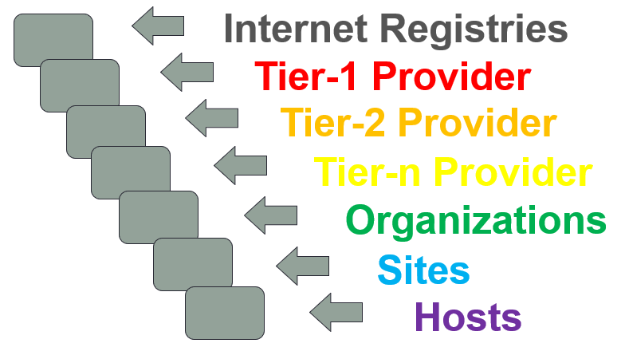
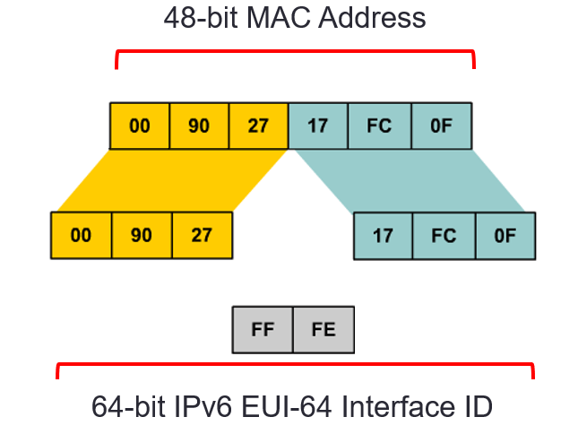

# ACIT 2620

## Principles of Enterprise Networking

By: Yves Rene Shema

---

# Internet Protocol Version 6

---

## The Motivation for Moving to IPv6

- The ability to scale networks for future demands requires a large supply of IP addresses and improved mobility. 
  - IPv6 combines expanded addressing with a more efficient header. 
  - IPv6 satisfies the complex requirements of hierarchical addressing.

---

## IPv4 Address Depletion

- Though NAT, VLSM and CIDR were developed as workarounds and have helped to extend the life of IPv4, the address space is nearing exhaustion
- Below is a graph (05/2014) displaying the availability of /8 address Blocks

---

## What Happened to IPv5?

- The Internet Stream Protocol (ST) was developed to experiment with voice, video and distributed simulation.
- Newer ST2 packets used IP version number 5 in the header.
- Although not officially know as IPv5, ST2 is considered to be the closest thing.
- The next Internet protocol became IPv6.

---

## Features of IPv6

- Larger address space
- Elimination of public-to-private NAT
- Elimination of broadcast addresses 
- Simplified header for improved router efficiency
- Support for mobility and security
- Many devices and applications already support IPv6
- Prefix renumbering simplified

---

## Features of IPv6

- Multiple addresses per interface
- Address autoconfiguration
- No requirement for DHCP
- Link-local and globally routable addresses
- Multiple-level hierarchy by design 
- More efficient route aggregation
- Transition mechanisms from IPV4 to IPV6

---

## IPv6 Addressing Overview

- IPv6 increases the number of address bits by a factor of 4, from 32 to 128, providing a very large number of addressable nodes.

---

## IPv6 Address Space

- 2128  =  340,282,366,920,938,463,463,374,607,431,768,211,456 
- Or about 3.4×1038 
- 340 **undecillion**
- How big is it?
  
> Two raised to the 128th power is an astronomical number. In decimal terms, it is roughly **340 billion billion billion billion**—or, as Martin Levy of Hurricane Electric likes to say, “more than four quadrillion addresses for every star in the observable universe.”
> &mdash; [Astronomically inadequate - The Economist](https://www.economist.com/johnson/2011/01/31/astronomically-inadequate)

---

## IPv6 Address Specifics

- The 128-bit IPv6 address is written using 32 hexadecimal numbers.
- The format is **`x:x:x:x:x:x:x:x`**, where **x** is a 16-bit hexadecimal field, therefore each x represents four hexadecimal digits.
- Example address:
  - 2035:0001:2BC5:0000 : 0000:087C:0000:000A

---

## Abbreviating IPv6 Addresses

Leading 0s within each set of four hexadecimal digits can be omitted.
09C0 = 9C0
0000 = 0 
A pair of colons (“::”) can be used, once within an address, to represent any number (“a bunch”) of successive zeros.

---

## IPv6 Address Abbreviation Example

---

## IPv6 Address Abbreviation Examples

---

## IPv6 Address Abbreviation Examples

---

## IPv6 Address Components

- An IPv6 address consists of two parts: 
  - First 64 Bits: A subnet/network prefix 
  - Last 64 Bits: An interface ID

---

## Subnet Prefix

- IPv6 uses CIDR notation to denote the number of bits that represent the subnet.
- The prefix length is almost always /64.
  - However, IPv6 rules allow for either shorter or longer prefixes
- Deploying a /64 IPv6 prefix on a device recommended.
  - Allows Stateless Address Auto Configuration (SLAAC)

---

## Subnet Prefix

### Example

FC00:0:0:1::1234/64

is really

FC00:0000:0000:0001:0000:0000:0000:1234/64

- The first 64-bits (FC00:0000:0000:0001) forms the address prefix.
- The last 64-bits (0000:0000:0000:1234) forms the Interface ID.

---

## Interface Identifiers

- IPv6 addresses on a link must be unique.
- Using the link prefix length, IPv6 hosts can automatically create a unique IPv6 address. 
- The following Layer 2 protocols can dynamically create the IPv6 address interface ID:
  - Ethernet 
  - PPP
  - HDLC
  - NBMA, Frame Relay

---

## IPv6 Address Types

---

## IPv6 Unicast Address Scopes

- Address types have well-defined destination scopes: 
  - Link-local address
  - Unique-local addresses (replaced Site-local address)
  - Global unicast address
- Determined by the leading digits of the subnet prefix

---

- Link-local addresses—only on single link, not routed
  - FE80::/10 prefix
- Unique-local addresses—routed within private network (aka private IPv4 addresses)
  - FC00::/7 (still reserved) and FD00 prefix
- Global unicast addresses—globally routable
  - 2001 prefix most common

---

## Multiple IPv6 Addresses per Interface

- An interface can have multiple global IPv6 addresses.
- Typically, an interface is assigned a link-local and one (or more) global IPv6 address.
- For example, an Ethernet interface can have:
  - **Link-local address**
    (FE80::21B:D5FF:FE5B:A408)
  - **Global unicast address**
    (2001:8:85A3:4289:21B:D5FF:FE5B:A408)
- The Link-local address is used for local device communication.
- The Global address is used to provide Internet reachability.

---

## IPv6 Addressing Space Overview

**Note:** IPv6 Internet uses **2001::/3** which is **< 2%** of IPv6 address space

---

## Special IPv6 Addresses

---

## IPv6 Unicast Addresses

---

## IPv6 Link-Local Unicast Address

- Link-local addresses play a crucial role in the operation of IPv6.
- They are dynamically created using a link-local prefix of **FE80::/10** and a 64-bit interface identifier.

---

## IPv6 Global Unicast Address

- A global unicast address is an IPv6 address from the global public unicast prefix (2001::/16).
- These addresses are routable on the global IPv6 Internet. 
- Global unicast addresses are aggregated upward through organizations and eventually to the ISPs.

---

## IPv6 Global Unicast Address

- The global unicast address consists of:
  - A 48-bit global routing prefix (or possibly a 56-bit global routing prefix see [http://tools.ietf.org/html/rfc6177](http://tools.ietf.org/html/rfc6177))
  - A 16-bit subnet ID (or 8 bit Subnet ID)
  - A 64-bit interface ID

---

## IPv6 Global Unicast Address

- The current IANA global routing prefix uses the range that starts with binary 0010 (2000::/3).

---

## IPv6 Global Unicast Address

- The subnet ID can be used by an organization to create their own local addressing hierarchy. 

---

## IPv6 Address Allocation Process

---

## IPv6 Subnetting Overview

- CIDR notation is used
  - IPv6 address is in Hex
  - Network mask in decimal
- Number of subnet bits set to 1 define network prefix
- All other bits are for nodes
- There are no reserved addresses (network or broadcast)

## 2001:25:12:ab12:3456:dfb5:712:45FF/64

---

### Prefix Length, Allocation of Bits

- Example:  **2001:DB8:0:2F00:2AA:FF:FE28:9C5A/64**
- Prefix length (total number of network bits) is 64
- (Normally) 48 Bit Prefix (or 56 bit) is assigned by ISP
  - Allows for 16 subnet bits (or 8)  allow 65,535 LANs
- (Generally) 64 bits are used for hosts in IPv6

---

### IPv6 Subnetting with Global Unicast Addresses

- The global routing prefix is assigned to a service provider by IANA (/32).
- The site level aggregator (SLA) is assigned by the ISP (/48).
- The LAN ID represents individual subnets within the customer site and is administered by the customer (/64).

 

---

## IPv6 Address Hierarchy 

- Large address space
- Allows for multiple levels

---

## IPv6 Prefix Allocation Hierarchy and Policy Example

---

## IP Address Space Allocated to American Registry For Internet Numbers

- IPv6 Allocation Blocks
  - 2001:0400::/23
  - 2001:1800::/23
  - 2001:4800::/23
  - 2600:0000::/12
  - 2610:0000::/23
  - 2620:0000::/23
- Information on all IP address blocks that IANA has assigned is available at: [www.iana.org](www.iana.org).

---

## IPv6 Address Aggregation

- Large prefix for an organization
  - Can handle entire network
- ISPs summarize routes
  - All customer prefixes into one prefix
  - Make it available to the Internet
- Aggregation provides:
  - Efficient routing
  - Scalable routing
  - Fewer routes in global IPV6 routing table

---

### Aggregation Example

---

## Good Practice in IPv6 Addressing

- Hosts should have globally routable addresses created with stateless autoconfiguration
  - Use 2001 prefix
  - Use /64 eui-64 to create them
- Serial links between routers should not use globally routable addresses
  - Use FC00 / FD00 prefix and static addressing
  - Use a prefix length /64
  - However, the prefix length could also be, for example, /112

---

## IPv6 Header Changes

- Improved routing efficiency
- No requirement for processing checksums
- Simpler and more efficient extension header mechanisms
- Flow labels for per-flow processing

---

## IPv4 Header vs. IPv6 Header

---

## Protocol and Next Header Fields

---

## Extension Headers

- The Next Header field identifies what follows the Destination Address field:

---

## Extension Headers

- The destination node examines the first extension header (if any). 

---

## Extension Header Options

---

## Extension Header Chain Order

---

## IPv6 Multicast Addresses

- Multicasting is at the core of many IPv6 functions and is a replacement for the broadcast address. 
- They are defined by the prefix **FF00::/8**.

---

## IPv6 Multicast Address

- The second octet of the address contains the prefix and transient (lifetime) flags, and the scope of the multicast address.

---

## IPv6 Multicast Address

- The multicast addresses **FF00::** to **FF0F::** are permanent and reserved.

---

## Reserved IPv6 Multicast Addresses

---

## Ethernet Multicast: MAC Revisited

- In the simplest of terms a host (router / pc) will listen for multiple addresses.
- These include specific multicast addresses that the hosts wishes to receive messages on.

---

## IPv6 Neighbor Discovery

- Resolve the link-layer address of a neighboring node to which an IPv6 packet is being forwarded.
- Determine when the link-layer address of a neighboring node has changed.
- Determine whether a neighbor is still reachable.
- Discover neighboring routers.
- Auto configure addresses, address prefixes, routes, and other configuration parameters.
- Advertise router presence, host configuration parameters, routes, and on-link prefixes.
- Inform hosts of a better next-hop router address to forward packets for a specific destination.

---

### Neighbor Discovery ICMPv6 Packet Types

- Neighbor Discovery uses five ICMPv6 packet types

---

## Solicited-Node Multicast Addresses

- The solicited-node multicast address (FF02::1:FF) is used for:
  - Neighbor discovery (ND) process 
  - Stateless address autoconfiguration
- The Neighbor discovery (ND) process is used to:
  - Determine the local-link address of the neighbor
  - Determine the routers on the link and default route
  - Keep track of neighbor reachability
  - Send network information from routers to hosts

---

### Neighbor Solicitation Example

- ICMPv6 Neighbor Solicitation (NS) is similar to IPv4 ARP.
- For Host A to send a packet to Host B it needs the MAC address of Host B.

---

### Neighbor Advertisement Example

Each destination node that receives the NS responds with an ICMPv6 message type 136, NA, including Host B.

---

## Stateless Address Autoconfiguration (SLAAC)

- Every IPv6 system (other than routers) is able to build its own unicast global address. 
  - Enables new devices to easily connect to the Internet.
  - No configuration or DHCP servers is required.
- IPv6 Router - sends network-type info on local link.
  - IPv6 prefix
  - Default IPv6 route
- IPv6 Hosts - listen on local link and configure themselves.
  - IP Address (Extended Unique Identifier 64 bit)
  - Default route

---

### Stateless Address Autoconfiguration

---

### Ethernet EUI-64 IPv6 Addresses ([RFC 4862](http://tools.ietf.org/html/rfc4862) )

- The first 64 bits are the network portion of the address and are specified or learned via SLAAC.
- The interface ID (second 64-bits) is the host portion of the address and is automatically generated by the router or host device.
- The interface ID on an Ethernet link is based on the 48-bit MAC address of the interface with an additional 16-bit **0xFFFE** inserted in the middle of the MAC address.
- The seventh bit of the First Byte is then inverted. 
  - (This bit is called the universal/local bit, with a value of 0 meaning that the MAC is a universal burned-in address)
- The above can lead to privacy concerns, which [RFC 4941](http://tools.ietf.org/html/rfc4941) attempts to address (see also [IPv6 on Windows](https://www.networkacademy.io/ccna/ipv6/ipv6-on-windows)).

---

## EUI-64 IPv6 Interface Identifier

---

## Stateless Autoconfiguration Process

---

### Stateless Autoconfiguration Process

- Host A creates a link-local address and solicited-node address using the RA supplied by the router.
- Host A verifies that it’s new IPv6 address is unique using DAD process.

---

## Learn more

- [IANA number resources](https://www.iana.org/numbers)
- [North American IPv6 Rules](https://www.arin.net/participate/policy/nrpm/)

---

## Reading List

- [Introduction to DHCP (video)](https://learning.oreilly.com/videos/building-linux-servers/9780137368495/9780137368495-BLS1_02_03_01/)
- [What is a Routing Protocol](https://learning.oreilly.com/library/view/ospf-network-design/9781587140846/9781587140846_ch02lev1sec1.html)
- [BIRD Internet Routing Daemon - Configuration](https://bird.network.cz/?get_doc&v=20&f=bird-3.html#ss3.1)