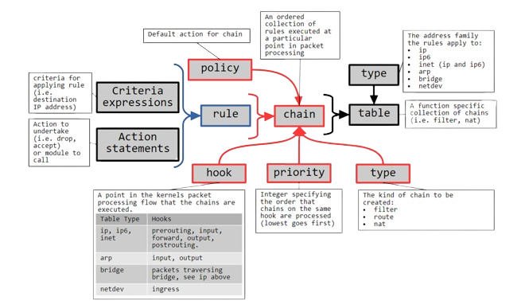
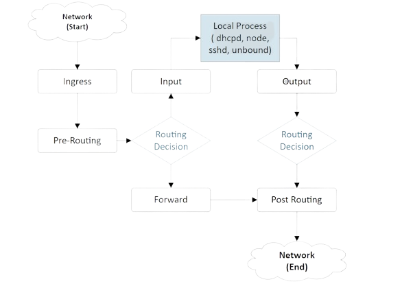
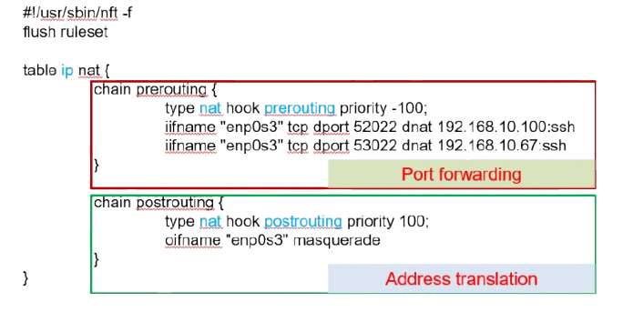

<style scoped>
  h1, h2, p, footer {
    color: white
  }

  div.banner {
    padding: 1em;
    background: rgb(0, 0, 0, .6);
  }
</style>


<div class="banner">

# ACIT 2620

## Principles of Enterprise Networking

By: Yves Rene Shema

</div>

---

## Packet filtering with Netfilter

---

<style scoped>
    span { color: teal;}
</style>

## Packet Filtering

- Network devices such as router can filter traffic based on some well-defined rules
- This is often used to implement firewalls
- Traffic can be filtered based on source/destination IP addresses and port numbers, protocol type, connection state, …
- Packet filtering is also used to implement <span>Network Address Translation (NAT)</span>

---

<style scoped>
    span { color: teal;}
</style>

## Netfilter

- Overall name for the project that houses all firewalling functions in Linux
- Also name of the framework for connecting (hooking) functions to different stages of the Linux networking stack
- Provides tools for configuring firewalls:
  - <span>**nftables**</span> (replaced iptables)
  - <span>**firewalld**</span>

---

<style scoped>
    img {
        width: 80%;
    }

    div.image { text-align: center;}
</style>

## Netfilter Concepts

<div class="image">



</div>

---

## Netfilter: Rules

- As packets are processed by the kernel, there are opportunities to apply rules to the packet
- Components of a rule:
  - Criteria expression
    e.g.:
    - all traffic leaving from or going to 10.0.16.0/24 
    - all UDP packets
  - Action statement
    - e.g.: drop, accept, count

---
<style scoped>
    span { color: teal;}
</style>

## Netfilter: Chains

- Chains are sets of rules attached to a particular point in the processing of a packet
- There are multiple points in the processing of a packet where rules can be executed. These points are called <span>**“hooks”**</span>
- Rules within a chain are evaluated by priority until one matches

---

## Netfilter: Hooks

There are 5 default chains/hooks for IPv4 and IPv6 datagrams

| Chain | Allows you to process packets ... |
| ----- | ----------------------------------|
| FORWARD | that flow through a gateway computer, coming in one interface and going right back out another
|
| INPUT | just before they are delivered to a local process
|
| OUTPUT | just after they are generated by a local process
|
| POSTROUTING | just before they leave the network interface
|
| PREROUTING | just as they arrive from a network interface
|

---

<style scoped>
    img {
        width: 70%;
    }

    div.image { text-align: center;}
</style>

## Netfilter: Packet flow through hooks

<div class="image">



</div>

---

## Netfilter: Tables

- There are types of packets that can be handled
- Each type is associated with a collection of valid hooks that can be applied
- Tables are groupings of chains with associated valid hooks that apply to a particular type of packets

---

## Netfilter: Tables

| Type | Description |
| ---- | ----------- |
| ip | IPv4 datagrams |
| ip6 | IPv6 datagrams |
| inet | IPv4 and IPv6 datagrams |
| arp | ARP traffic (i.e. Layer 2 traffic) |
| bridge | Traffic traversing bridges |
| netdev | Sees all traffic arriving on network device |

---

<style scoped>
    span { color: teal;}
</style>

## Netfilter: Common matches

* <span>iifname</span>: input interface name
* <span>oifname</span>: output interface name
* <span>ether daddr</span>: Ethernet destination address
* <span>ether saddr</span>: Ethernet source address
* <span>ip daddr</span>: IPv4 destination address
* <span>ip saddr</span>: IPv4 source address
* <span>ip proto</span>: IPv4 contained protocol

---
<style scoped>
    span { color: teal;}
</style>

- <span>tcp sport</span>: tcp source port
- <span>tcp dpor</span>t: tcp destination port
- <span>udp sport</span>: udp source port
- <span>udp dport</span>: udp destination port
- <span>ct state</span>: the state of the connection (established, related, new, untracked)
- <span>ct direction</span>: the direction of the connection (original, reply)

---

## Example 1: `/etc/sysconfig/nftables.conf`

```text title="/etc/sysconfig/nftables.conf"
#!/usr/sbin/nft -f
flush ruleset

table ip filter {
    chain input {
        type filter hook input priority 0;
        policy drop;

        iifname "lo" counter accept 
        iifname "enp0s3" tcp dport ssh counter accept 
        iifname "enp0s3" ip protocol {icmp,ospf} counter accept		 
        iifname "enp0s8" ip saddr 10.0.15.0/24 counter accept
        iifname "enp0s8" ip daddr 255.255.255.255 udp sport 68 udp dport 67 counter accept
        ct state related,established counter accept
    }

    chain forward {
        type filter hook forward priority 0;
        policy drop;

        iifname "enp0s8" ip saddr 10.0.15.0/24 counter accept
        iifname "enp0s3" ip daddr 10.0.15.0/24 tcp dport 22 counter accept
        iifname “enp0s3” ip protocol icmp ip daddr 10.0.15.0/24 counter accept		
        ct state related,established counter accept
    }

    chain output {
        type filter hook output priority 0;
        policy accept;
    }
}
```

---

## Example 2: /etc/sysconfig/nftables.conf

```text title="/etc/sysconfig/nftables.conf"
#!/usr/sbin/nft -f
flush ruleset

table ip nat {
    chain prerouting { 
        ##### Port Forwarding ######

        type nat hook prerouting priority -100;
        iifname "enp0s3" tcp dport 52022 dnat 192.168.10.100:ssh
        iifname "enp0s3" tcp dport 53022 dnat 192.168.10.67:ssh
    }

    chain postrouting { 
        ##### Address translation #######
        
        type nat hook postrouting priority 100;
        oifname "enp0s3" masquerade
    }
}
```

<!--  -->

---

## Reading List

- [DNS (Read up to 10.1.2 nslookup and dig)](https://intronetworks.cs.luc.edu/current/html/intro.html#transport)