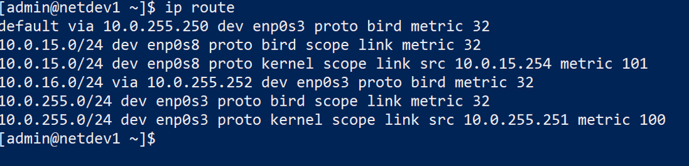
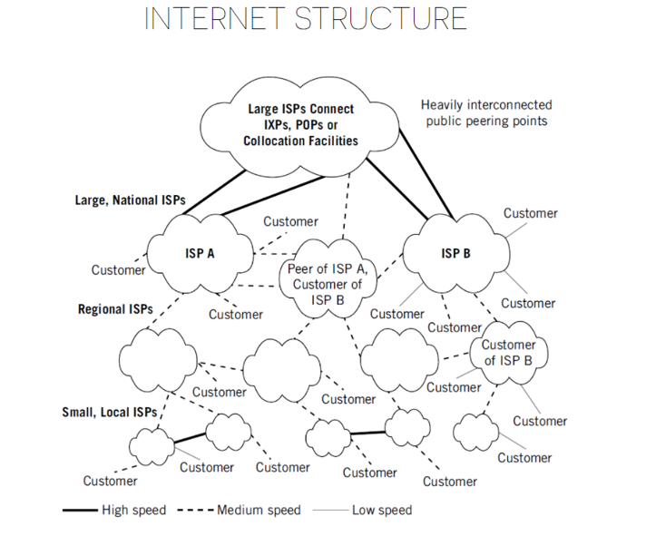

<style scoped>
  h1, h2, p, footer {
    color: white
  }

  div.banner {
    padding: 1em;
    background: rgb(0, 0, 0, .6);
  }
</style>


<div class="banner">

# ACIT 2620

## Principles of Enterprise Networking

By: Yves Rene Shema

</div>

---

# DHCP

---

## Purpose

- Dynamic Host Configuration Protocol
- Allows a host on a network to automatically be assigned an IP address
- Addresses assigned from a pool of addresses set aside by the network admnistrator
- Allows discovery of additional information about the network
  - Default gateway
  - DNS servers

---

## DORA

- Discorver
  - client sends a **broadcast** signal to find a DHCP server
- Offer
  - if found, the server responds with an IP lease offer
- Request
  - request sent by client to accept the IP lease offer
- Acknowledgement
  - server confirms the IP lease

---

## Configuring ISC DHCP server

- Edit the `/etc/dhcp/dhcpd.conf` configuration file
- Check for syntax errors:
  - `sudo dhcpd -t`
- enable and run the service
  
  ```bash
  sudo systemctl enable dhcpd
  sudo systemctl start dhcpd
  ```

---

## Configuring ISC DHCP server

- Define the subnet

```ini
subnet 10.0.1.0 netmask 255.255.255.0 {
  range 10.0.1.2 10.0.1.240;
}
```

- Address pool must:
  - be in the specified subnet
  - not include any addresses reserved for fixed allocation

---

## Configuring ISC DHCP server

- Specify default gateways
  
```ini
option routers 10.0.1.1;
```

- This option must match a subnet defined in the configuration

---

## Configuring ISC DHCP server

- Specify DNS servers

```ini
option domain-name-servers 8.8.8.8, 1.1.1.1;
```

---

## Configuring ISC DHCP server

- Reserve a fixed address

```ini
host http_server {
  hardware ethernet a2:1f:2f:3f:4f:5f;
  fixed-address 10.0.1.241;
}
```

---

# Routing Protocols

---

## Review: Layer 2

- Link layer (layer 2) handles sending datagrams to hosts directed connected within the same LAN
- Limited broadcast, cannot cross network’s boundaries

---

## Review: Layer 3

- Network layer handles sending datagrams across network boundaries - internetworking
- IP address consists of two parts: network ID and host ID
- Hosts and routers look at the network ID to determine if a destination address is local or outside 

---

## Review: Routing table

- Hosts and routers maintain a routing table used in making routing decisions
- Each entry in a routing table (called route) represents a possible path a datagram might take to reach its destination

---

## Review: Routing table

- Each route in a routing table has 4 main components:
  - Destination value
  - Subnet mask
  - Gateway or interface address
  - Route cost or metric

---

## Review: Routing table

- Example:



---

## Route types: Connected

- Directly attached, local-network (to the router) addresses.
- Identified in the routing table with “scope link”
- These routes are automatically updated whenever the interface is reconfigured or shut down

---

## Route types: Static

- Manually configured routes.
- Identified in the routing table with “proto static”

---

## Route types: Dynamic

- Automatically created and maintained by routing protocols.
- Identified in the routing table by the name of the protocol that created them

---

## Route types: Default

- Specifies the gateway to use when the routing table does not contain a path for the destination network.
- Commonly points to the next router in the path to the ISP
- Identified by the word “default” or subnet “0.0.0.0/0” in the destination value field

---

<style scoped>
    div.table {
        font-family: monospace;
        font-size: 0.8em;
        margin-bottom: 1em;
        background: #eee;
        padding: 0.2em 0.5em;
    }
    span { color: red;}
    span.next-hop { color: teal; font-weight: bold;}
</style>

## Determine packet's next hop

Based on the following routing table:

<div class="table">
default via <span>172.16.31.254</span> dev eth1 proto zebra metric 10 <br />
<span>172.16.16.0/22</span> via <span>172.16.31.249</span> dev eth1 proto zebra metric 20</br />
<span>172.16.20.0/22</span> via <span>172.16.31.250</span> dev eth1 proto zebra metric 20<br />
<span>172.16.24.0/22</span> dev eth0 proto kernel scope link src 172.16.27.254<br />
<span>172.16.28.0/23</span> via <span>172.16.31.252</span> dev eth1 proto zebra metric 20<br />
<span>172.16.30.0/24</span> via <span>172.16.31.253</span> dev eth1 proto zebra metric 20<br />
<span>172.16.31.0/24</span> dev eth1 proto kernel scope link src 172.16.31.251
</div>

a) What is next hop destination of a datagram addressed to <span class="next-hop">172.16.27.70</span>?
b) What is next hop destination of a datagram addressed to <span class="next-hop">172.16.32.100</span>?
c) What is next hop destination of a datagram addressed to <span class="next-hop">172.16.23.23</span>?
d) What is next hop destination of a datagram addressed to <span class="next-hop">172.16.18.200</span>?

---

<style scoped>
    div.table {
        font-family: monospace;
        font-size: 0.8em;
        margin-bottom: 1em;
        background: #eee;
        padding: 0.2em 0.5em;
    }
    span { color: red;}
    span.next-hop { color: teal; font-weight: bold;}
</style>

### Determine packet's next hop

Based on the following routing table:

<div class="table">
default via <span>2001:2019:12:FFFF::FFFF</span> dev eth0 proto kernel metric 1024<br />
<span>2001:2019:12:ffff::/64</span> dev eth0 proto kernel metric 256<br />
<span>2001:2019:12:1fff::/64</span> dev eth1 proto kernel metric 256<br />
<span>2001:2019:12:2fff::/64</span> dev eth2 proto kernel metric 256<br />
<span>2001:2019:12:1001::/64</span> via <span>2001:2019:12:1fff::50</span> dev eth1 metric 1024<br />
<span>fe80::/64</span> dev eth0 proto kernel metric 256<br />
<span>fe80::/64</span> dev eth1 proto kernel metric 256<br />
<span>fe80::/64</span> dev eth2 proto kernel metric 256<br />

</div>

a) What is next hop destination of a datagram addressed to <span class="next-hop">2001:2019:12:ffff::1</span>?
b) What is next hop destination of a datagram addressed to <span class="next-hop">2001:2019:12:1001::ffff</span>?
c) What is next hop destination of a datagram addressed to <span class="next-hop">2001:2019:ffff:ffff::1</span>?
d) What is next hop destination of a datagram addressed to <span class="next-hop">fe80::c001:37ff:fe6c:0</span>?

---

# Routing Protocols



---

## Routing protocols: internet structure

- The Internet is composed of interlocking network pieces, much like a jigsaw puzzle.
- Each piece is called an autonomous system (AS), and it’s convenient to think of each ISP as an AS, although this is not strictly true.
- The Autonomous systems connect directly to each other at Points of Presence or via Internet Exchanges Points
- When AS's connect they become peers and setup policies on what routes to exchange.

---

## Routing protocols: learning routes

- Routers initially know IP addresses and prefixes configured on their local interfaces
- Routers communicate with their neighbours to learn the required information about their routing domain to forward packets hop by hop, toward a given destination.
- So routers establish communications with adjacent routers ( i.e. those one hop away) and ask them about the routing information they know.

---

## Routing protocols: learning routes

- Each router then builds up a detailed routing information database about the network.
- This exchange of information is governed by routing protocols
- Routing protocols differ depending on whether they are used within a routing domain or between different routing domains

---

## Routing protocols: learning routes

- Within a routing domain, several different interior routing protocols can be used.
- Interior routing protocols, or IGPs, run between the routers inside a single routing domain, or autonomous system (AS)
- Between routing domains on the Internet an exterior Gateway Routing Protocol is used: Border Gateway Protocol (BGP)

---

## Routing protocols: Interior Gateway Protocol (IGP)

- A routing protocol that was designed and intended for use inside a single autonomous system (AS)
- Examples: OSPF, EIGRP, RIP

---

## Routing protocols: Exterior Gateway Protocol (EGP)

- A routing protocol that was designed and intended for use between different autonomous systems
- Examples: BGP

---

## Routing protocols: Functions

- Learn routing information about IP subnets from other neighboring routers.
- Advertise routing information about IP subnets to other neighboring routers.
- If more than one possible route exists to reach one subnet, pick the best route based on a metric.
- If the network topology changes, for example, a link fails, react by advertising that some routes have failed and pick a new currently best route. (This process is called convergence)

---

## Routing protocols: Algorithms

### Distance Vector

- Distance may be computed as the number of hops to destination or other metrics such as bandwidth, propagation delay, …
- Vector: router updates in the form of {Dest, Cost}
- Minimum view of network topology
- Wait for route reports from neighboring routers before updating routing table
- Example protocols: RIP, EIGRP, DSDV

---

## Routing protocols: Algorithms

### Link-state

- Routing table - List of the known paths and interfaces.
- Link-state advertisement (LSA) - Small packet of routing information that is sent between routers. LSAs describe the state of the interfaces (links) of a router and other information, such as the IP address of each link.
- Topological database - convergence
- Shortest Path First (SPF) algorithm – map of network seen from the point of view of the router. SPF tree used to build routing table

---

## Routing protocols: OSPF

- Link-state algorithm
- Uses LSAs to generate a link-state database
- Stub area: advertised network area which does not participate in LSA
- Use of Designated Router (DR) and Backup Designated Router (BDR) for efficient management of link-state advertisements

---

## Reading List

- [Transport Layer](https://intronetworks.cs.luc.edu/current/html/intro.html#transport)
- [UDP](https://intronetworks.cs.luc.edu/current/html/udp.html#user-datagram-protocol-udp)
- [TCP Basics](https://intronetworks.cs.luc.edu/current/html/tcpA.html#tcp-transport-basics)