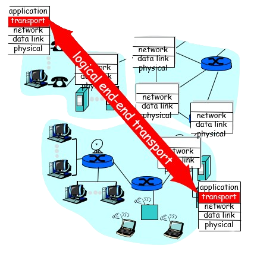
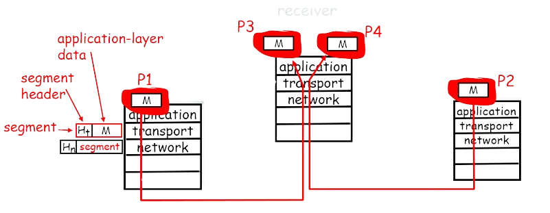
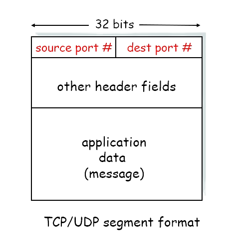
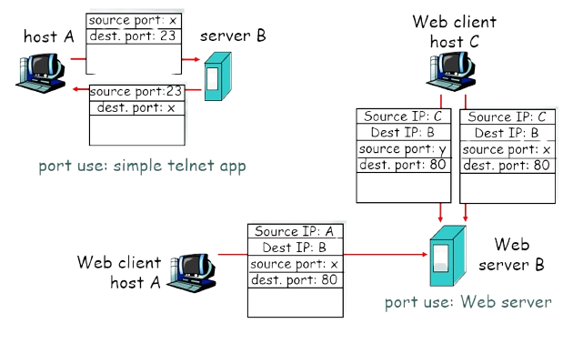
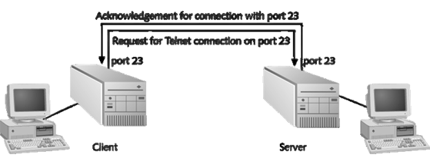
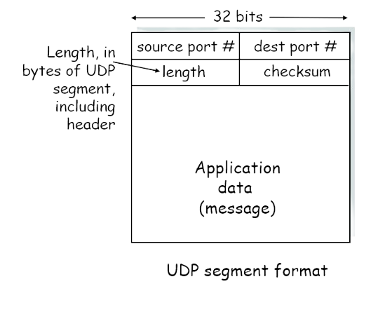
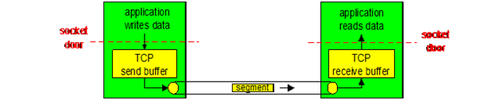
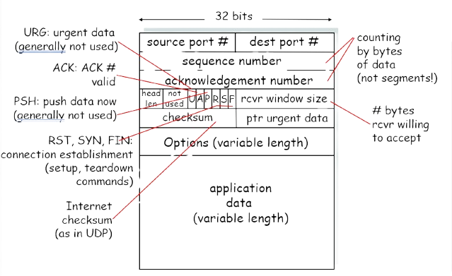
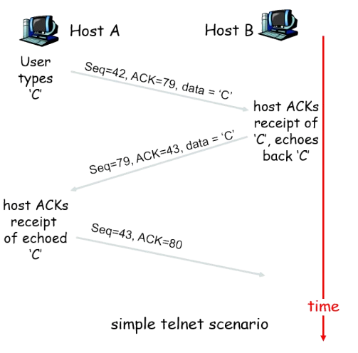
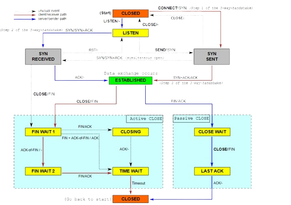

<style scoped>
  h1, h2, p, footer {
    color: white
  }

  div.banner {
    padding: 1em;
    background: rgb(0, 0, 0, .6);
  }
</style>


<div class="banner">

# ACIT 2620

## Principles of Enterprise Networking

By: Yves Rene Shema

</div>

---

# Transport Layer Protocols

## TCP & UDP

---

## Transport Services and Protocols

- provide logical communication between app’ processes running on different hosts
- transport protocols run in end systems 
- network layer: data transfer between end systems
- transport layer: data transfer between processes 
  - relies on, enhances, network layer services 



---

## Transport-layer protocols

### Internet transport services

- reliable, in-order unicast delivery (TCP)
  - congestion 
  - flow control
  - connection setup
- unreliable (“best-effort”), unordered unicast or multicast delivery: UDP
- services not available: 
  - real-time
  - bandwidth guarantees
  - reliable multicast 

---

## Multiplexing / Demultiplexing: What

**segment** - unit of data exchanged between transport layer entities

**Demultiplexing** - delivering received segments to correct app layer processes
  


---

## Multiplexing / Demultiplexing: How

**Multiplexing** - gathering data from multiple app processes, enveloping data with header (later used for demultiplexing)

- based on sender, receiver port numbers, IP addresses
  - source, destination port #s in each segment
  - well-known port numbers for specific applications



---
<style scoped>
    img {
        width: 80%;
    }

    div.image { text-align: center;}
</style>

## Multiplexing / Demultiplexing: Examples

<div class="image">



</div>

---

## Socket

- Logical address assigned to a specific process running on a host computer
- The socket’s address combines the host computer’s IP address with the port number associated with a process



---

## Port Numbers

- 0 to 1023 : “well-known” ports
  - systems restrict to use by privileged processes only. 
  - IANA controls the mapping of service names to port numbers 
- 1024 to 49151 “registered” ports 
  - systems permit ordinary user processes to use. 
  - IANA maintains a mapping of names to port numbers but does not exert control over them
- 49152 to 65535 : “dynamic” or “private” ports
  - are not subject to IANA registration.
- [http://www.iana.org/assignments/port-numbers](http://www.iana.org/assignments/port-numbers)
- `/etc/services` – list of ports and services

---
<style scoped>
    li span { color: red;}
</style>

## UDP: User Datagram Protocol [RFC 768]

- “no frills,” “bare bones” Internet transport protocol
- “best effort” service, UDP segments may be:
- lost
- delivered out of order to app
- <span>**connectionless**:</span>
  - no handshaking between UDP sender, receiver
  - each UDP segment handled independently of others

---

### Why is there a UDP?

- no connection establishment (which can add delay)
- simple: no connection state at sender, receiver
- small segment header
- no congestion control: UDP can blast away as fast as desired

---

## UDP Uses and Format

- often used for streaming multimedia apps
  - loss tolerant
  - rate sensitive
- other UDP uses 
  - DNS
  - SNMP
- reliable transfer over UDP: add reliability at application layer
  - application-specific error recovery



---

<style scoped>
    h2 span { font-size: .8em; margin-left: 4em}
    li span { color: red;}
</style>

## TCP: Overview   <span>RFCs: 793, 1122, 1323, 2018, 2581</span>

- <span>**point-to-point:**</span>
  - one sender, one receiver 
- <span>**reliable, in-order byte stream:**</span>
  - no “message boundaries”
- <span>**pipelined:**</span>
  - TCP congestion and flow control set window size
- <span>**send & receive buffers**</span>



---

<style scoped>
    h2 span { font-size: .8em; margin-left: 4em}
    li span { color: red;}
</style>

## TCP: Overview (cntd)

- <span>**full duplex data:**</span>
  - bi-directional data flow in same connection
  - MSS: maximum segment size
- <span>**connection-oriented: **</span>
  - handshaking (exchange of control msgs) init’s sender, receiver state before data exchange
- <span>**flow controlled:**</span>
  - sender will not overwhelm receiver

---

<style scoped>
    img {
        width: 80%;
    }

    div.image { text-align: center;}
</style>

## TCP segment structure

<div class="image">



</div>

---

## TCP Sequence #’s and Acknowledgements

**Seq. #’s:**
  * byte stream “number” of first byte in segment’s data

**ACKs:**
  * seq # of next byte expected from other side
cumulative ACK

TCP spec doesn’t say how receiver handles out-of-order segments



---

<style scoped>
    img {
        width: 65%;
    }

    div.image { text-align: center;}
</style>

## TCP in action: States

<div class="image">



</div>

---

## TCP States in Action

```bash
#ss -tn
State      Recv-Q Send-Q       	Local Address:Port               Peer Address:Port 
ESTAB      0      0		142.232.107.85:43420           	216.58.193.78:443 
FIN-WAIT-1 0      1		142.232.107.85:40359           	142.232.2.1:80
ESTAB      0      0		142.232.107.85:34221          	142.232.204.52:445
ESTAB      0      0          	142.232.107.85:48256          	142.232.204.50:445
SYN-SENT   0      1           	142.232.107.85:41974           	142.232.2.1:10123
ESTAB      0      0            	172.16.100.6:47180             	10.0.255.26:22
FIN-WAIT-1 0      1           	142.232.107.85:54207           	23.58.117.226:80
ESTAB      0      0            	142.232.107.85:36948          	142.232.204.52:445 

```

---

## Reading List

- [Managing firewall with nftables](https://docs.redhat.com/en/documentation/red_hat_enterprise_linux/8/html/configuring_and_managing_networking/getting-started-with-nftables_configuring-and-managing-networking#getting-started-with-nftables_configuring-and-managing-networking)