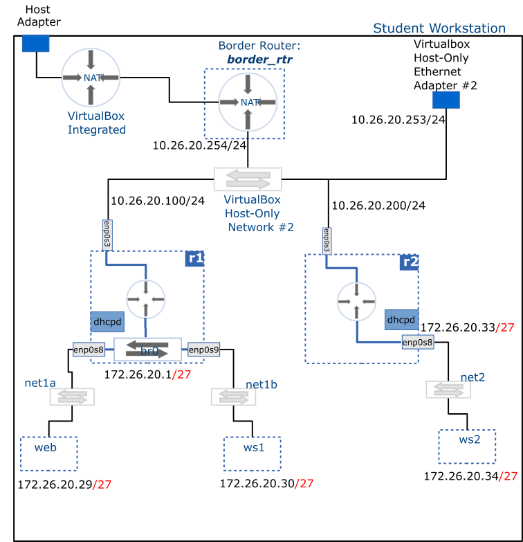

# DHCP Server

This activity configures a DHCP service in __r1__ and __r2__ which will handle IP configuration requests from __net1__ and __net2__ subnets respectively.

When completed, hosts within __net1__ and __net2__ subnets (`web`, `ws1`,` ws2`) will have their network settings configured dynamically via DHCP.

## Deliverable



## Setup

Ensure __web__, __ws1__ and __ws2__ are configured to obtain their IPv4 configuration dynamically; i.e. remove their statically assigned IPv4 addresses and set their configuration method to be automatic.

You will need to use the __nmtui__ tool to achieve this.

<br />
<br />

> [!IMPORTANT] Configuration steps
> In general, there are three steps involved in provisioning  a service on Linux:
>
> - Edit configuration file (typically located under the `/etc/` directory)
> - Validate configuration file - check for any syntax errors
> - Enable and start the service - often by leveraging the `systemd` framework

<br />

## Install ISC Kea

> [!NOTE]
> Run `border-rtr` before proceeding.

- Enable the kea repository:

  ```bash
  curl -1sLf 'https://dl.cloudsmith.io/public/isc/kea-3-0/setup.rpm.sh' | sudo -E bash
  ```

- Install:

  ```bash
  sudo dnf install isc-kea
  ```

> [!TIP]
> If the above commands fail, you may need to refresh the DNS settings of `r1` and `r2`. Running the following commands should fix it (run both in `r1` and `r2`):

```bash
sudo nmcli con modify enp0s3 ipv4.method auto
sudo nmcli con up enp0s3
```

After installation, restore manual configuration.

## Edit configuration file

The dhcpd service listens to requests based on the subnets declarations inside the `/etc/kea/kea-dhcp4.conf` file. In both __r1__ and __r2__, find this file and open it using your preferred text editor, and add configuration options to allocate addresses as described in the diagram.

An example configuration is given below (this is only an example; your configuration must use the IP subnets specified in the diagram):

<details>
<summary>Example <code>kea-dhcp4.conf</code> file</summary>

<pre><code>
# /etc/kea/kea-dhcp4.conf

{
  "Dhcp4": {
        "interfaces-config": {
          "interfaces": ["enp0s8"]
        },
        "option-data": [
          {
            "name": "routers",
            "data": "10.0.2.1"
          },
          {
            "name": "domain-name-servers",
            "data": "8.8.8.8, 1.1.1.1"
          }
        ],
        "subnet4": [
          {
            "id": 1,
            "subnet": "10.0.2.0/24",
            "pools": [
              {
                "pool": "10.0.2.100-10.0.2.199"
              }
            ],
            "reservations": [
              {
                "hw-address": "d2:d1:de:ed:ff:1f",
                "ip-address": "10.0.2.10"
              }
            ]
          }
        ]
  }
}
</code></pre>
</details>

## Enable and start the service

1. Check syntax errors: 

```bash 
sudo kea-dhcp4 -t /etc/kea/kea-dhcp4.conf
```

2. Start the service: 

```bash
sudo systemctl start kea-dhcp4
```

3. Enable the service to always start at boot: 

```bash
sudo systemctl enable kea-dhcp4
```

## Add routes on your Windows workstation

To be able to log into your __net1__ and __net2__ hosts from your host, you need to add routes.

Run the following command in Powershell as administrator to add a route to __net1__:

```pwsh
New-NetRoute -DestinationPrefix "172.26.20.0/27" -InterfaceIndex $index -NextHop 10.26.20.100
```

where `$index` is the interface index of your __Host-Only Ethernet Adapter #2__ (hint: run `Get-NetAdapter` to find out the index value)

For convenience, you may also update your `./ssh/config` file with login credentials for __web__ and __ws1__.

> [!TIP] macOS users
> If you are on a mac, you may need to do a bit of internet search to find out how to add routes permanently on your system.  
> 
> This [blog post](https://www.analysisman.com/2020/11/macos-staticroutes.html) might provide answers (I can't guarantee that it works on all mac versions)

## Troubleshooting

- Before starting the service, ensure there are not syntax errors by running: `sudo kea-dhcp4 -t /etc/kea/kea-dhcp4.conf`.
- Ensure the subnet declarations in your configuration files match those in your topology.
- Check service status: `systemctl status kea-dhcp4`
- To check logs messages while the service is running: `journalctl -u kea-dhcp4`