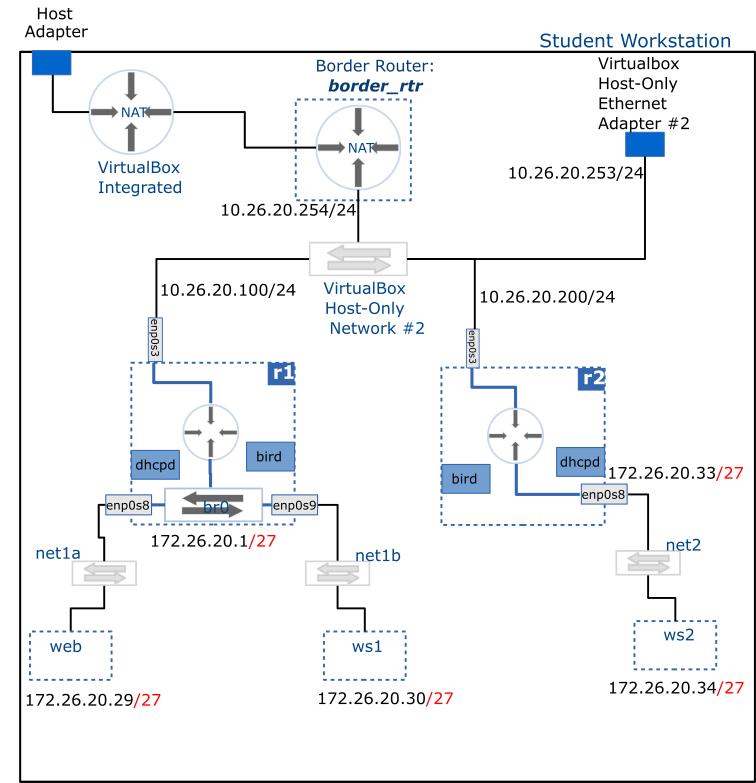

# Dynamic Routing

This activity configures dynamic routing in __r1__ and __r2__ using the OSPF protocol. This will enable the two routers to exchange topological information with their neighbors and build their routing tables without manual interventions (so no static routes required).

We will use a software package called `bird` (which is already installed on your VM's) to configure OSPF. `bird` also supports other dynamic routing protocols including RIP and BGP.

## Deliverable



## Setup

> [!IMPORTANT] Remove static routes
> Log into __r1__ and __r2__ and remove the static routes you added in previous milestones. **Also, remove the default gateway route** from `enp0s3` as this will from here onwards be part of the information dynamically exchanged between routers.
>
> You will need to use the __nmtui__ tool to achieve this.

<br />

> [!IMPORTANT] Configuration steps
> The configuration steps that follow are to be carried out for both __r1__ and __r2__ routers.

## Edit configuration

The configuration file for `bird` is located at `/etc/bird.conf`. This file already contains a great deal of configuration options which we do not need, so make a backup of the file, then delete the original and recreate it. An example configuration is given below:

<details>
<summary>Example <code>bird.conf</code> file</summary>

<pre><code>
# /etc/bird.conf

log syslog all;             # Log all messages

router id 10.20.30.200;     # use your routers enp0s3 IP as its ID

protocol device {           # the device "protocol" needs to be included to
                            # activate all of the interfaces
}

protocol kernel {
    ipv4 {                  # export all routes learned by bird to the kernel
          export all;       # routing table
    };
}

protocol ospf {            # Activate OSPF
    area 0 {
        interface "enp0s3" { # Configure the enp0s3 connected network to be
        };                   # advertised to other routers. Also send and receive
                             # link state advertisements on this interface

        interface "enp0s8" { # Configure the enp0s8 connected network to be
            stub;            # to be advertised to other routers. Don't send or
        };                   # receive link stat advertisements on this interface
                             # accomplished by the "stub" directive
    };
}
</code></pre>
</details>

## Enable and start the service

1. Check syntax errors:

```bash
sudo bird -p
```

2. Start the service: 

```bash
sudo systemctl start bird.service
```

3. Enable the service to always start at boot: 

```bash
sudo systemctl enable bird.service
```

## Troubleshooting

- Check to verify that ospf is configured on the appropriate interfaces: `sudo birdc show ospf interface`
- Check service status: `systemctl status bird.service`
- To check logs messages while the service is running: `journalctl -u bird`