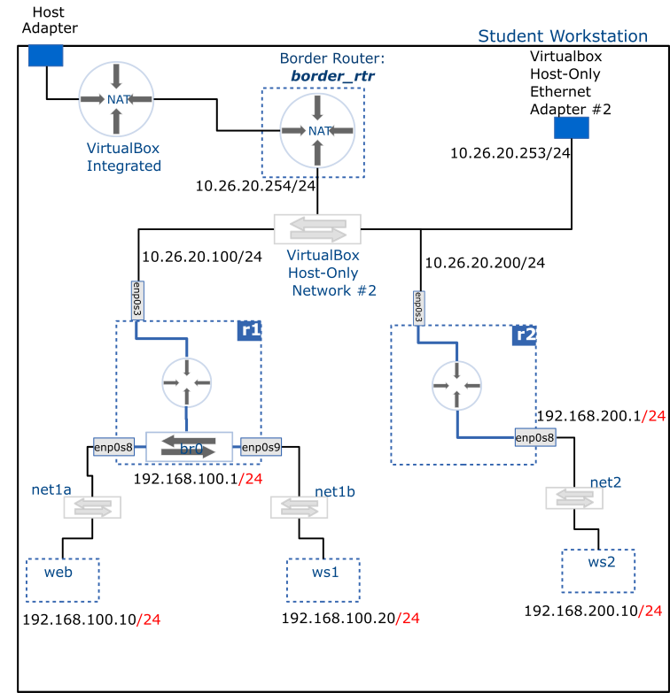

# IPv4 Static Router



Published {{ date | timeago }}

This activity creates statically configured routing in __`r1`__ and __`r2`__. These routers are placed in an inter-network hierarchy and traffic is observed as it is routed between the networks.

## Deliverable



## Setup

Three distinct IP networks need to exist by the end of the activity.

- __Host-Only Network #2__. Network Address: <u>10.26.20.0/24</u>
- __net1__ (`net1a` & `net1b` joined by the bridge in __r1__). Network Address: <u>192.168.100.0/24</u>
- __net2__. Network Address: <u>192.168.200.0/24</u>

The following VMs will need to exist:

- __border_rtr__: imported as an appliance in the previous milestone
- __r1__: created in the previous milestone
- __r2__: created in the previous milestone
- __web__: created in the previous milestone
- __ws1__: created in the previous milestone
- __ws2__: newly created VM that is a linked clone of __centos_8_base__
- __ws3__: (optional) newly created VM that is a linked clone of **centos_8_base**

Attached to __Host-Only Network #2__ are the following VM's:

- __border_rtr__
- __r1__
- __r2__

Attached to the __net1a__ network are the following VM's:

- __r1__
- __web__

Attached to the **net1b** network are the following VM's:

- __r1__
- __ws1__

> [!IMPORTANT] net1
> Note that __net1a__ and __net1b__, though initially distinct networks, are now part of the same broadcast domain (i.e. same LAN) thanks to the bridge configured in __r1__.

Attached to the __net2__ network are the following VM's:

- __r2__: An additional <u>Paravirtualized Network Adapter</u> (virtio-net)  will need to be added to this device. Ensure it is connected to an internal network named __net2__
-  __ws2__: (linked clone based on the __centos_8_base__ image; should have a single network adapter attached to __net2__ network)
-  __ws3__ (Optional)  (linked clone based on the __centos_8_base__ image; should have a single network adapter attached to __net2__ network)

## Router Configuration

> [!TIP] Configuration steps:
>
> 1. IP configuration of router interfaces: `enp0s3` and `br0` for __r1__, `enp0s3` and `enp0s8` for __r2__
> 2. Enable IP forwarding
> 3. Configure routes

You will need to use the __NetworkManager__ through the `nmcli/nmtui` tools to create permanent configuration in the two routers and associated hosts.

It is perhaps easier to complete the following steps using the `nmtui` tool, but if you prefer working on the command line, a command reference for `nmcli`  can be found under command hints heading at the bottom of this section:

### Configuring `r1`

1. Start by detaching the `enp0s3` interface from the bridge. The quickest way to do this would be to first delete the `enp0s3` configuration. The following command will do it:

    ```bash
    sudo nmcli con delete enp0s3
    ```

    At this point, the bridge will be left in control of the remaining two interfaces, i.e. `enp0s8` and `enp0s9`.

    Then run the following command to create a new configuration for the `enp0s3` interface:

    ```bash
    sudo nmcli con add type ethernet con-name enp0s3 ifname enp0s3
    ```

    Now you are ready to proceed with the next steps.

2. Using the nmtui or nmcli tools, edit the `enp0s3` IP configuration as follows:
    - Switch from __Automatic__ to __Manual__ configuration
    - In the IP address field, enter: __10.26.20.100/24__
    - In the Gateway field, enter:  __10.26.20.254__
    - Select the __Edit__ button next to the __Routing tab__, and enter a destination and next-hop values for the __net2__ subnet (you should understand what that means at this point)
    - Save your changes and proceed to the next step

3. Edit the bridge IP configuration as follows:
    - Switch from __Automatic__ to __Manual__ configuration
    - In the IP address field, enter: __192.168.100.1/24__
    - Save your changes and proceed to the next step
4. Re-activate both the `enp0s3` and the bridge interfaces
5. Enable IP forwarding (__see the note at the end of this section__)

### Configuring `r2`

1. Before going any further, ensure you __have enabled a second adapter__ and attached it to an internal network named __net2__ as described in the setup notes above
2. Using the `nmtui` or `nmcli` tools, edit the `enp0s3` IP configuration as follows:
    - Switch from __Automatic__ to __Manual__ configuration
    - In the IP address field, enter: __10.26.20.200/24__
    - In the Gateway field, enter:    __10.26.20.254__
    - Select the __Edit__ button next to the __Routing tab__, and enter a destination and next-hop values for the __net1__ subnet (you should understand what that means at this point)
    - Save your changes and proceed to the next step

3. Edit the `enp0s8` IP configuration as follows:
    - Switch from __Automatic__ to __Manual__ configuration
    - In the IP address field, enter: __192.168.200.1/24__
    - Save your changes and proceed to the next step

4. Re-activate both the `enp0s3` and the `enp0s8` interfaces
5. Enable IP forwarding (**see the note at the end of this section**)

<br />
<br />

> [!IMPORTANT] Enabling IP Forwarding
> 
> IP forwarding is the mechanism by which a host takes packets coming through one interface and forward them out through another interface. 
> This is not enabled by default. To enable it, proceed as follows:
> 
> - Using a text editor such as __Vim__ or __nano__, open the following file: <u>/etc/sysctl.conf</u> and add the following line at the bottom of it (this requires root privileges, i.e. __sudo__):
>
>  ```text
>  net.ipv4.ip_forward = 1
>  ```
>
> Run the following command to activate the changes:
>
> ```bash
> sudo sysctl --system
> ```

<br />
<br />

> [!TIP] nmcli command reference
> 
> Delete a connection:
> 
> ```bash
> sudo nmcli con delete [connection_name]
> ```
> 
> Create connection and configure IP: 
> 
> ```bash
> sudo nmcli con add type ethernet con-name [connection_name] ifname [interface_name] ipv4.addresses [IP]/[cidr] ipv4.method manual ipv4.gateway [GATEWAY_IP] +ipv4.routes "[network_id] [gateway]"
> ```
> 
> The previous command can be broken down into multiple steps using the nmcli con modify command:  
> 
> Configure default route: 
> 
> ```bash
> sudo nmcli con modify [connection_name]     ipv4.gateway [GATEWAY_IP]
> ```
> 
> Configure routes: 
> 
> ```bash
> sudo nmcli con modify [connection_name] +ipv4.routes "[network_id] [gateway]"
> ```
> 
> Save changes: 
> 
> ```bash
> sudo nmcli con reload
> ```
    
## Host Configuration

IP configuration for __web__, __ws1__, __ws2__, and optionally __ws3__ is done in a similar fashion. So the steps provided below apply to all of them, but pay attention to the different values for each:

1. Before going any further, ensure __ws2__ (and optionally __ws3__) exist and are attached to the __net2__ network as described in the setup note above.
2. Using the `nmtui/nmcli` tools, edit the `enp0s3` IP configuration as follows:

- Switch from __Automatic__ to __Manual__ configuration
- In the IP Address field, enter: 
  - __web__: 192.168.100.10/24
  - __ws1__:  192.168.100.20/24
  - __ws2__:  192.168.200.10/24
  - __ws3__:  192.168.200.20/24 (this is optional)
- In the Gateway field, enter:
  - __web__ and __ws1__:  192.168.100.1
  - __ws2__ and __ws3__:   192.168.200.1
- Save the changes and re-activate the interface.

## Troubleshooting

- Verify that links are active: `ip link show`
- Verify IP address on interfaces: `ip addr`
- Verify routing configuration: `ip route show` (this is also how you find the default gateway for a host)
- Test connectivity and routing (you may also use `ping`):
  - In **web**: `sudo traceroute -I 192.168.100.1`
  - In **web**: `sudo traceroute -I 10.26.20.100`
  - In **web**: `sudo traceroute -I 10.26.20.200`
  - In **web**: `sudo traceroute -I 192.168.200.1`
  - In **web**: `sudo traceroute -I 192.168.200.10`
  - In **ws2**: do the reverse of the previous traces

After verifying that everything works correctly, submit your report to the milestone's dropbox folder.
