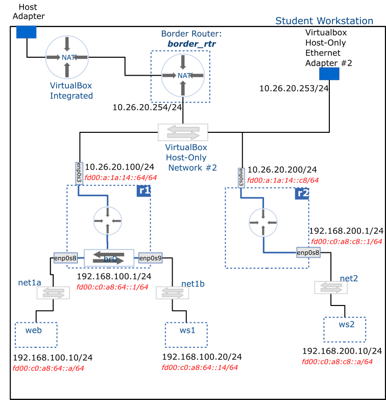

# IPv6 Static Router

This activity creates statically configured IPv6 routing in __r1__ and __r2__. These routers are placed in an inter-network hierarchy and IPv6 traffic is observed as it is routed between the networks.

## Deliverable



## Setup

Three distinct networks should already be in places from previous milestones, arranged in the topology described below:

- __Host-Only network #2__:
  - the host
  - border router (border_rtr)
  - router #1 (r1)
  - router #2 (r2)
- __net1__ created by joining the internal networks `net1a` and `net1b` with a bridge:
  - router #1 (r1)
  - web
  - ws1
- __net2__:
  - router #2 (r2)
  - ws2

## Router configuration

> [!IMPORTANT] Configuration steps
>
> ### Configuration steps
> 
> 1. IPv6 configuration of router interfaces: enp0s3 and br0 for r1, enp0s3 and enp0s8 for r2
> 2. Enable IPv6 forwarding
> 3. Configure IPv6 routes

### r1 configuration

> [!TIP] Tools
> You may use the **`nmtui`** tool to complete this task.
>
>If you prefer the **`nmcli`** command line tool, the command hints at the end of this section may be of help.

- **`enp0s3`** IPv6 configuration is as follows:
  - Address: `FD00:A:1A:14::64/64`
  - Method: manual
  - Route to net2: `FD00:C0:A8:C8::/64` via `FD00:A:1A:14::C8`

- **`br0`** IPv6 configuration is as follows:
  - Address: `FD00:C0:A8:64::1/64`
  - Method: manual

- Enable IPv6 forwarding, edit the following file: `/etc/sysctl.conf` and add the following line at the bottom of the file:

```text
net.ipv6.conf.all.forwarding = 1
```

- To activate the changes, run:

```bash
sudo sysctl --system
```

### r2 configuration

> [!TIP] Tools
> You may use the **`nmtui`** tool to complete this task.
>
>If you prefer the **`nmcli`** command line tool, the command hints at the end of this section may be of help.

- **`enp0s3`** IPv6 configuration is as follows:
  - Address: `FD00:A:1A:14::C8/64`
  - Method: manual
  - Route to net1: `FD00:C0:A8:64::/64` via `FD00:A:1A:14::64`
- **`enp0s8`** IPv6 configuration is as follows:
  - Address: `FD00:C0:A8:C8::1/64`
  - Method: manual
- Enable IPv6 forwarding, edit the following file: `/etc/sysctl.conf` and add the following line at the bottom of the file:

```text
net.ipv6.conf.all.forwarding = 1
```

- To activate the changes, run:

```bash
sudo sysctl --system
```

## Hosts configuration

> [!TIP] Tools
> You may use the **`nmtui`** tool to complete this task.
>
>If you prefer the **`nmcli`** command line tool, the command hints at the end of this section may be of help.

- **`web`** and **`ws1`** IPv6 configuration
  - **`web`** Address: `FD00:C0:A8:64::A/64`
  - **`ws1`** Address: `FD00:C0:A8:64::14/64`
  - method: manual
  - gateway: `FD00:C0:A8:64::1`
- **`ws2`** IPv6 configuration
  - Address: `FD00:C0:A8:C8::A/64`
  - method: manual
  - gateway: `FD00:C0:A8:C8::1`


> [!TIP] Command hints
> 
> ### Command hints
>
> Add IPv6 address to an interface:
>
> ```bash 
> sudo nmcli con modify [name_of_connection] ipv6.addresses [address]/[cidr] ipv6.method manual
> ```
>
> Add IPv6 address and default gateway to an interface:
>
> ```bash
> sudo nmcli con modify [name_of_connection] ipv6.addresses [address]/[cidr] ipv6.method manual ipv6.gateway default_gateway_addr
> ```
>
> Add IPv6 route to an interface:
>
> ```bash 
> sudo nmcli con modify [name_of_connection] +ipv6.routes "destination_netID next_hop"
> ```
>
> Refresh configuration:
>
> ```bash
> sudo nmcli con up [name_of_connection]
> ```

## Troubleshooting

- Verify that links are active: `ip link show`
- Verify IP address on interfaces: `ip -6 addr`
- Verify routing configuration: `ip -6 route show`
- Test connectivity and routing (you can also just use **`ping6`**):
  - In **`web`**: `sudo traceroute6 -I fd00:c0:a8:64::1`
  - In **`web`**: `sudo traceroute6 -I fd00:a:1a:14::64`
  - In **`web`**: `sudo traceroute6 -I fd00:a:1a:14::c8`
  - In **`web`**: `sudo traceroute6 -I fd00:c0:a8:c8::1`
  - In **`web`**: `sudo traceroute6 -I fd00:c0:a8:c8::a`
  - In **`ws2`**: do the reverse of the previous traces
