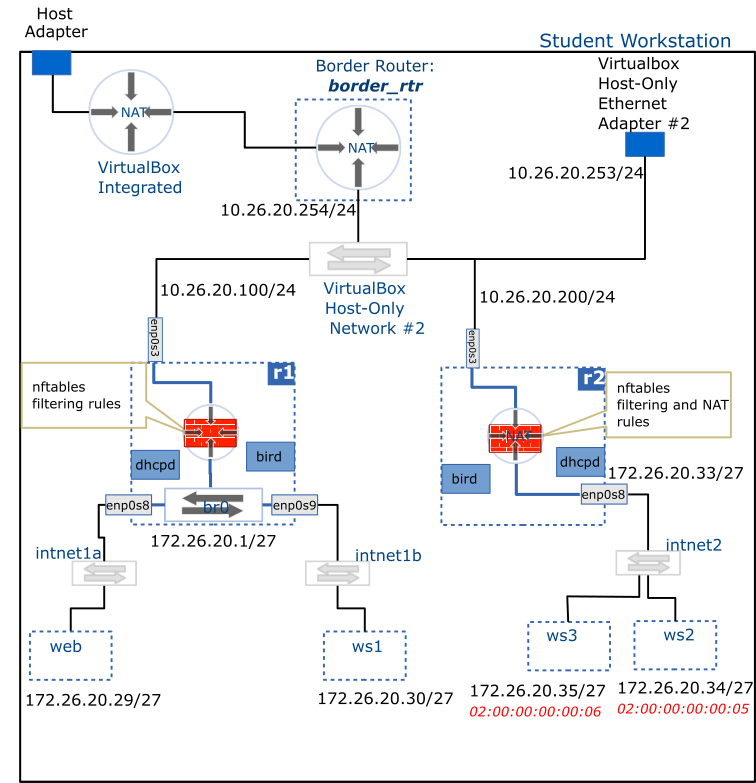

# Packet filtering & NAT

In this activity we configure the __r1__ router to perform packet filtering on all traffic between the __Host-only Network #2__ and __net1__. In other words, all traffic to and from __net1__ will now have to go through a Netfilter firewall.

We also use __Netfilter__ to configure the __r2__ router to perform Network Address Translation (NAT, __including port forwarding__) on all traffic between the __Host-only Network #2__ and __net2__.

## Deliverable




## Setup

### nftables - Firewall

`nftables` firewall will be implemented in __r1__ with the following rules:

1. Allow all traffic into the loopback adapter of the router
1. By default, deny all traffic entering the router
1. Allow incoming `ssh`, `ospf`, `dns` and `icmp` traffic into the router when it enters through the `enp0s3` interface.
1. Allow all return traffic into the router
1. By default, deny all traffic into the __net1__ network
1. Allow `icmp` traffic into the __net1__ network from anywhere
1. Allow incoming `ssh`, `http` and `https` traffic into __web__
1. Allow incoming `ssh` traffic into __ws1__
1. Allow all return traffic into __net1__

### nftables - NAT

Network Address Translation (NAT) will be implemented in __r2__ using nftables.

> [!TIP] Private network
> A network placed behind a NAT router should not be directly accessible from outside unless __port forwarding__ is in place. Therefore, the `bird.service` on __r2__ will need to be reconfigured __NOT__ to publish the internal network status (i.e. remove the `enp0s8` interface from the __ospf__ configuration block on __r2__).


The NAT configuration should provide the following functions:

1. Translate all traffic coming from __net2__ so that it appears to originate from the IP of `enp0s3` on __r2__
1. Forward traffic arriving on `enp0s3` addressed to __r2__'s `enp0s3` IP with destination port __52022__ and translate it so it is addressed to __ws2__ on port __22__
1. Forward traffic arriving on `enp0s3` addressed to __r2__'s `enp0s3` IP with destination port __53022__ and translate it so it is addressed to __ws3__ on port __22__
1. Allow all return traffic into __net2__
1. You will be able to login remotely from your workstation to __ws2__, and __ws3__ using __r2__'s IP address on ports __52022__ and __53022__ respectively (you may optionally add login credentials for __ws2__ and __ws3__ to your host's `~/.ssh/config`)
1. You should be able to access the internet (e.g. ping) from __ws2__ and __ws3__.
1. You should __NOT__ be able to access __ws2__ and __ws3__ directly using their respective private IP addresses.

<br />
<br />

> [!TIP] Configuration steps
> Both the firewall and NAT configuration go into the `/etc/sysconfig/nftables.conf` file.
>
> 1. Edit the configuration file
> 1. Validate the configuration file to ensure it contains no syntax errors
> 1. Enable and run the service using `systemd`. The service's name is `nftables.service`

<br />

## Troubleshooting

- To verify that your configuration is correct, run the following:

```bash
sudo nft -cf /etc/sysconfig/nftables.conf
```

No output means your configuration has no syntax errors. If errors are shown, fix them and repeat until validation passes.

You can use __nmap__ to verify that your firewall is letting in only permitted traffic. Run the following from anywhere in your network to verify that only `ssh`, `http` and `https` ports are open on __web__:

```bash
sudo nmap -n -sS 172.16.1.29
```

After configuration NAT in __r2__, verify that you are able to login remotely into either __ws2__ or __ws3__ from your host.

The `ssh` command takes a `-p` option for specifying a port for the connection. For example, you can login into __ws2__ like so:

```pwsh
ssh admin@10.26.20.200 -p 52022
```

<br />

> [!TIP] Port forwarding
> Note that were are using __r2__'s address instead of that of __ws2__. This is because access to __ws2__ is allowed only through the port we configured through port forwarding.

<br />

If you managed to login successfully, you may proceed to adding an entry for __ws2__ to your host's `~/.ssh/config`. In addition to specifying the hostname, username and access key, you will also need to provide the port to connect to:

```javascript
host ws2
        Hostname 10.26.20.200
        Port 52022
        User admin
        IdentityFile ~/.ssh/acit_admin_id_rsa
```

## Resources

- [Use ss (netstat) to gather network statistics](https://www.redhat.com/en/blog/ss-command)
- [Getting started with netcat](https://nmap.org/ncat/guide/ncat-usage.html)
- [Getting started with nmap](https://nmap.org/book/osdetect-usage.html)
- [Managing firewall with nftables](https://docs.redhat.com/en/documentation/red_hat_enterprise_linux/8/html/configuring_and_managing_networking/getting-started-with-nftables_configuring-and-managing-networking#getting-started-with-nftables_configuring-and-managing-networking)