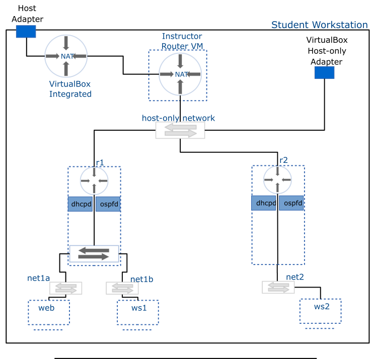

# Router Project Overview

## Introduction

This project is an investigation into the foundations of computer networking through the construction of a router. This router will be functionally equivalent to common off the shelf SOHO routers.

## Overview

The project is organized around a series of topics. Each of the topics is explored through the completion of a configuration activity and by answering a series of related questions. Each topic and its activities and questions must be completed and submitted before you move on to the next one.

## Project Help

Each topic contains additional information to aid in the completion of the activity and questions, this includes:

- a list of tools used with an example and additional resources
- a list of files modified during the activity including a description, an example, and further resources.
- a list of troubleshooting approaches, tools, and references if available.
- a list of activity specific hints.

## Deliverables

Upon completion of the project you will have two functioning routers with various capabilities including network address translation and some filtering, and providing additional services such as dynamic host configuration to the rest of the network.

## Milestones

1. A functioning Ethernet Switch
2. Two routers providing static IPv4 routing.
3. Two routers providing static IPv6 static routing
4. Two parts:
   - A running DHCP server
   - Two routers capable of performing dynamic routing
5. Two routers performing packet filtering (firewall and port forwarding)

## "Hardware" Elements

These routers will be constructed as a virtual machines based on commodity PC hardware to provide insight into networking , review computing concepts, introduce students to virtualization and to give maximum control throughout the construction process.
