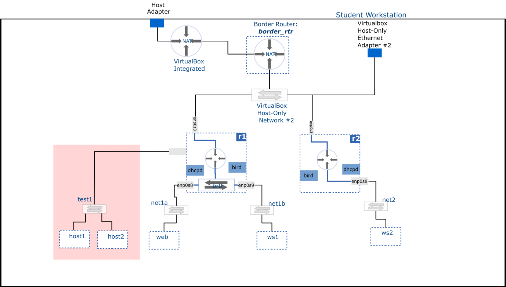

# Network Configuration - Scenario I

**Task**: Attach a new network to **r1** and configure it such that hosts within the network obtain their IP address dynamically and are able to communicate with any destination.

## Diagram

