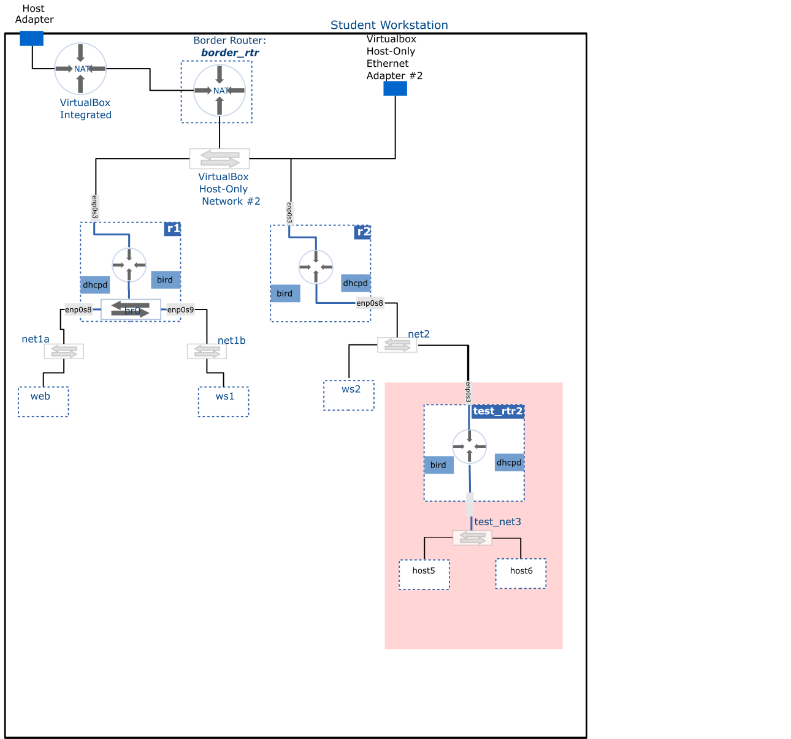

# Network Configuration - Scenario III

**Task**: Create a new router named **test_rtr2** and connect it to the **net2** network. Attach another network to **test_rtr2** and configure it such that hosts within the network obtain their IP address dynamically and are able to communicate with any destination.

## Diagram

## Clean-up

Delete **test_rtr2** and associated network.
