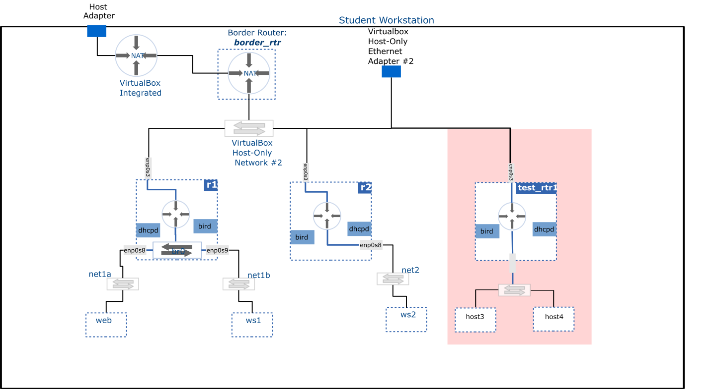

# Network Configuration - Scenario II

**Task**: Create a new router named **test_rtr1** and attach it to the same network as  **r1** and **r2**. Additionally, attach **test_rtr1** to a new network named **test_net2** and configure it such that hosts within the new network obtain their IP address dynamically and are able to communicate with any destination.

## Diagram

## Details

- Configure **test_rtr1** as a DHCP server for the **test_net2** network using the following IP range:
  - **192.168.20.64/27**
- Enable routing in **test_rtr1** and configure it to advertise a route to **test_net2** to neighboring routers
- Verify that you can reach hosts within **test_net2** network from elsewhere in your topology
  
## Clean-up

Delete **test_rtr1** and all hosts within **test_net2** network.
