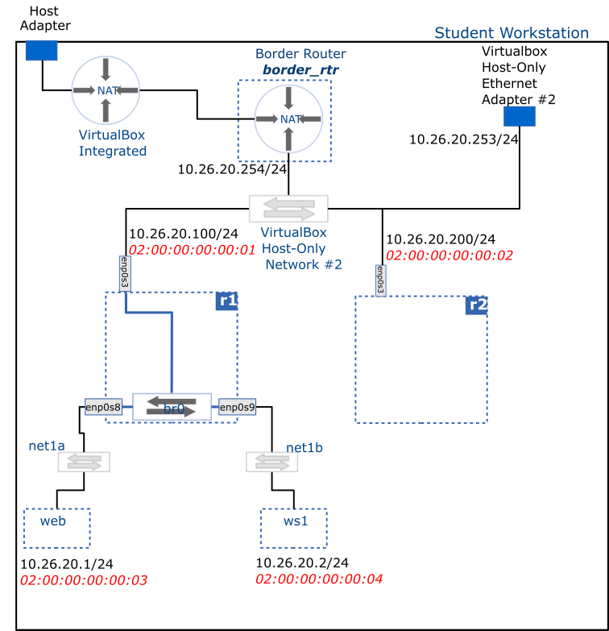

# Create an Ethernet Switch/Bridge

This activity configures the **r1** VM as an Ethernet switch (aka. multi-port bridge) by adding additional Ethernet interfaces and creating a logical "Bridge" between them.

This 'switch' is placed in a network hierarchy and traffic is observed passing 'through' the switch.

## Deliverable

## Steps

### Step 1

- Ensure you have completed the [Project Setup activity](./project-setup) and that you can access **r1** and **r2** from the host.
- Configure two more Ethernet adapters on **r1** as follows (power off the VM before applying the changes):
  - Adapter 2: connected to an Internal Network: **`net1a`**
  - Adapter 3: connected to an Internal Network: **`net1b`**
- These interfaces will use the Paravirtualized Network (virtio-net) Adapter Type and have Promiscuous Mode set to Allow All

> [!NOTE]
> These adapters will be named **enp0s8** and **enp0s9** respectively (see Red Hat interface naming conventions below)

> [!IMPORTANT]
> :bulb:
> Once we have configured the bridge, the two internal networks (**`net1a`** and **`net1b`**) together with the **`Host-Only network #2`** will be joined into a single broadcast domain.

### Step 2

> [!NOTE]
> You will complete the following tasks using the **`nmtui`** tool.
>
> You can also use the command line version, **`nmcli`** (see [nmcli command reference below](#nmcli-command-reference))

- Delete any existing connections (aka configurations)
- Create a connection for the bridge **`br0`**
- Create a connections for each of the slave interfaces: **`enp0s3`**, **`enp0s8`**, **`enp0s9`**, adding them as ports to the **`br0`**
- Enable autoconnection of the slave interfaces on the bridge connection
- Reload the bridge configuration
- (Optionally) Set **`br0`**'s IP via DHCP:   `dhclient br0 –v`   (the -v option suppresses errors)

> [!NOTE]
> The IP address assigned to the **br0** is used solely for administration of the machine, i.e. in order to connect **r1** via SSH (for example, if we need to transfer files). A bridge doesn't require an IP Address to function as a bridge.

> [!TIP]
> :memo: Explore your bridge
>
> - Show your interfaces (**r1**)   `ip link show`
>   - ensure that **r1**'s physical interfaces are now managed by the bridge
> - Show bridge state:   `bridge link show`
>   - ensure all bridge ports are in forwarding state
> - Show the forwarding table:   `bridge fdb show | grep -v permanent`
>   - are there any MAC addresses you recognize?

### Step 3

- Clone a new VM named **web** (linked clone, reset MAC address) from the **rocky_linux_base** VM and configure its Network `Adapter 1` as follows:
  - Connected to Internal Networking – **`net1a`** network
  - MAC address: 02:00:00:00:00:03
- Clone another VM named **ws1** (workstation 1) as above and configure its Network `Adapter 1` as follows:
  - Connected to Internal Networking – **`net1b`** network
  - MAC address: 02:00:00:00:00:04
- Start the **web** and **ws1** VM’s and find out their IP addresses using the `ip` command.
- Ensure you are able to ping **ws1** from **web** and vice versa. You should also be able to ping **r1**, **r2** and the host from both **web** and **ws1**.

> [!TIP]
> :bulb:
> <h3><a name="nmcli-command-reference">nmcli command reference</a></h3>
> 
> You can achieve everything we did above on the command line using the commands below (sometimes using the command line is faster, but it takes getting used to):
> 
> Connection/Configuration management:
> 
> - Show connections:  nmcli connection show`
> 
> - Delete connection:  `nmcli connection del connection_name`
> 
> - Bring up connection:  `nmcli connection up connection_name`
> 
> Bridge management:
> 
> - Create bridge:  `nmcli connection add type bridge con-name connection_name ifname bridge_name`
> 
> - Add link to bridge:  `nmcli connection add type ethernet slave-type bridge con-name connection_name ifname interface_name master bridge_name`
> 
> - Activate ports when bridge activated:  `nmcli con modify bridge_name connection.autoconnect-slaves 1`
> 
> - Bring up bridge:  `nmcli con up bridge_name`

## References

- [Red Had Interface naming conventions](https://access.redhat.com/documentation/en-us/red_hat_enterprise_linux/8/html/configuring_and_managing_networking/consistent-network-interface-device-naming_configuring-and-managing-networking)
- [Configuring host names using hostnamectl](https://access.redhat.com/documentation/en-us/red_hat_enterprise_linux/7/html/networking_guide/sec_configuring_host_names_using_hostnamectl)
- [Configuring IP networking using the ip command](https://access.redhat.com/documentation/en-us/red_hat_enterprise_linux/7/html/networking_guide/sec-configuring_ip_networking_with_ip_commands)
- [Configuring IP networking using nmtui](https://access.redhat.com/documentation/en-us/red_hat_enterprise_linux/7/html/networking_guide/sec-configuring_ip_networking_with_nmtui)
- [Getting started with nmcli](https://access.redhat.com/documentation/en-us/red_hat_enterprise_linux/7/html/networking_guide/sec-configuring_ip_networking_with_nmcli)
- [Configuring a network bridge](https://access.redhat.com/documentation/en-us/red_hat_enterprise_linux/8/html/configuring_and_managing_networking/configuring-a-network-bridge_configuring-and-managing-networking)
